# Исследование объявлений о продаже квартир

В вашем распоряжении данные сервиса Яндекс Недвижимость — архив объявлений о продаже квартир в Санкт-Петербурге и соседних населённых пунктах за несколько лет. Вам нужно научиться определять рыночную стоимость объектов недвижимости. Для этого проведите исследовательский анализ данных и установите параметры, влияющие на цену объектов. Это позволит построить автоматизированную систему: она отследит аномалии и мошенническую деятельность.

По каждой квартире на продажу доступны два вида данных. Первые вписаны пользователем, вторые — получены автоматически на основе картографических данных. Например, расстояние до центра, аэропорта и других объектов — эти данные автоматически получены из геосервисов. Количество парков и водоёмов также заполняется без участия пользователя.

### Откройте файл с данными и изучите общую информацию


```python
import pandas as pd
data = pd.read_csv('/datasets/real_estate_data.csv', sep='\t')
display(data.head()) #вывод первых 5 строк
print(data.info()) #вывод инфо о столбцах и значениях в них

```


<div>
<style scoped>
    .dataframe tbody tr th:only-of-type {
        vertical-align: middle;
    }

    .dataframe tbody tr th {
        vertical-align: top;
    }

    .dataframe thead th {
        text-align: right;
    }
</style>
<table border="1" class="dataframe">
  <thead>
    <tr style="text-align: right;">
      <th></th>
      <th>total_images</th>
      <th>last_price</th>
      <th>total_area</th>
      <th>first_day_exposition</th>
      <th>rooms</th>
      <th>ceiling_height</th>
      <th>floors_total</th>
      <th>living_area</th>
      <th>floor</th>
      <th>is_apartment</th>
      <th>...</th>
      <th>kitchen_area</th>
      <th>balcony</th>
      <th>locality_name</th>
      <th>airports_nearest</th>
      <th>cityCenters_nearest</th>
      <th>parks_around3000</th>
      <th>parks_nearest</th>
      <th>ponds_around3000</th>
      <th>ponds_nearest</th>
      <th>days_exposition</th>
    </tr>
  </thead>
  <tbody>
    <tr>
      <th>0</th>
      <td>20</td>
      <td>13000000.0</td>
      <td>108.0</td>
      <td>2019-03-07T00:00:00</td>
      <td>3</td>
      <td>2.70</td>
      <td>16.0</td>
      <td>51.0</td>
      <td>8</td>
      <td>NaN</td>
      <td>...</td>
      <td>25.0</td>
      <td>NaN</td>
      <td>Санкт-Петербург</td>
      <td>18863.0</td>
      <td>16028.0</td>
      <td>1.0</td>
      <td>482.0</td>
      <td>2.0</td>
      <td>755.0</td>
      <td>NaN</td>
    </tr>
    <tr>
      <th>1</th>
      <td>7</td>
      <td>3350000.0</td>
      <td>40.4</td>
      <td>2018-12-04T00:00:00</td>
      <td>1</td>
      <td>NaN</td>
      <td>11.0</td>
      <td>18.6</td>
      <td>1</td>
      <td>NaN</td>
      <td>...</td>
      <td>11.0</td>
      <td>2.0</td>
      <td>посёлок Шушары</td>
      <td>12817.0</td>
      <td>18603.0</td>
      <td>0.0</td>
      <td>NaN</td>
      <td>0.0</td>
      <td>NaN</td>
      <td>81.0</td>
    </tr>
    <tr>
      <th>2</th>
      <td>10</td>
      <td>5196000.0</td>
      <td>56.0</td>
      <td>2015-08-20T00:00:00</td>
      <td>2</td>
      <td>NaN</td>
      <td>5.0</td>
      <td>34.3</td>
      <td>4</td>
      <td>NaN</td>
      <td>...</td>
      <td>8.3</td>
      <td>0.0</td>
      <td>Санкт-Петербург</td>
      <td>21741.0</td>
      <td>13933.0</td>
      <td>1.0</td>
      <td>90.0</td>
      <td>2.0</td>
      <td>574.0</td>
      <td>558.0</td>
    </tr>
    <tr>
      <th>3</th>
      <td>0</td>
      <td>64900000.0</td>
      <td>159.0</td>
      <td>2015-07-24T00:00:00</td>
      <td>3</td>
      <td>NaN</td>
      <td>14.0</td>
      <td>NaN</td>
      <td>9</td>
      <td>NaN</td>
      <td>...</td>
      <td>NaN</td>
      <td>0.0</td>
      <td>Санкт-Петербург</td>
      <td>28098.0</td>
      <td>6800.0</td>
      <td>2.0</td>
      <td>84.0</td>
      <td>3.0</td>
      <td>234.0</td>
      <td>424.0</td>
    </tr>
    <tr>
      <th>4</th>
      <td>2</td>
      <td>10000000.0</td>
      <td>100.0</td>
      <td>2018-06-19T00:00:00</td>
      <td>2</td>
      <td>3.03</td>
      <td>14.0</td>
      <td>32.0</td>
      <td>13</td>
      <td>NaN</td>
      <td>...</td>
      <td>41.0</td>
      <td>NaN</td>
      <td>Санкт-Петербург</td>
      <td>31856.0</td>
      <td>8098.0</td>
      <td>2.0</td>
      <td>112.0</td>
      <td>1.0</td>
      <td>48.0</td>
      <td>121.0</td>
    </tr>
  </tbody>
</table>
<p>5 rows × 22 columns</p>
</div>


    <class 'pandas.core.frame.DataFrame'>
    RangeIndex: 23699 entries, 0 to 23698
    Data columns (total 22 columns):
     #   Column                Non-Null Count  Dtype  
    ---  ------                --------------  -----  
     0   total_images          23699 non-null  int64  
     1   last_price            23699 non-null  float64
     2   total_area            23699 non-null  float64
     3   first_day_exposition  23699 non-null  object 
     4   rooms                 23699 non-null  int64  
     5   ceiling_height        14504 non-null  float64
     6   floors_total          23613 non-null  float64
     7   living_area           21796 non-null  float64
     8   floor                 23699 non-null  int64  
     9   is_apartment          2775 non-null   object 
     10  studio                23699 non-null  bool   
     11  open_plan             23699 non-null  bool   
     12  kitchen_area          21421 non-null  float64
     13  balcony               12180 non-null  float64
     14  locality_name         23650 non-null  object 
     15  airports_nearest      18157 non-null  float64
     16  cityCenters_nearest   18180 non-null  float64
     17  parks_around3000      18181 non-null  float64
     18  parks_nearest         8079 non-null   float64
     19  ponds_around3000      18181 non-null  float64
     20  ponds_nearest         9110 non-null   float64
     21  days_exposition       20518 non-null  float64
    dtypes: bool(2), float64(14), int64(3), object(3)
    memory usage: 3.7+ MB
    None


```python
import matplotlib.pyplot as plt
#создала датафрейм, где только числовые объекты, чтобы построить гистограммы только для них
all_data = pd.DataFrame()
for column in data.columns: 
    if data[column].dtype in ['float64','str64']:
        all_data[column] = data[column]

#гистограммы для числовых объектов        
all_data.hist(figsize=(15, 20)) 
plt.show()

```


    
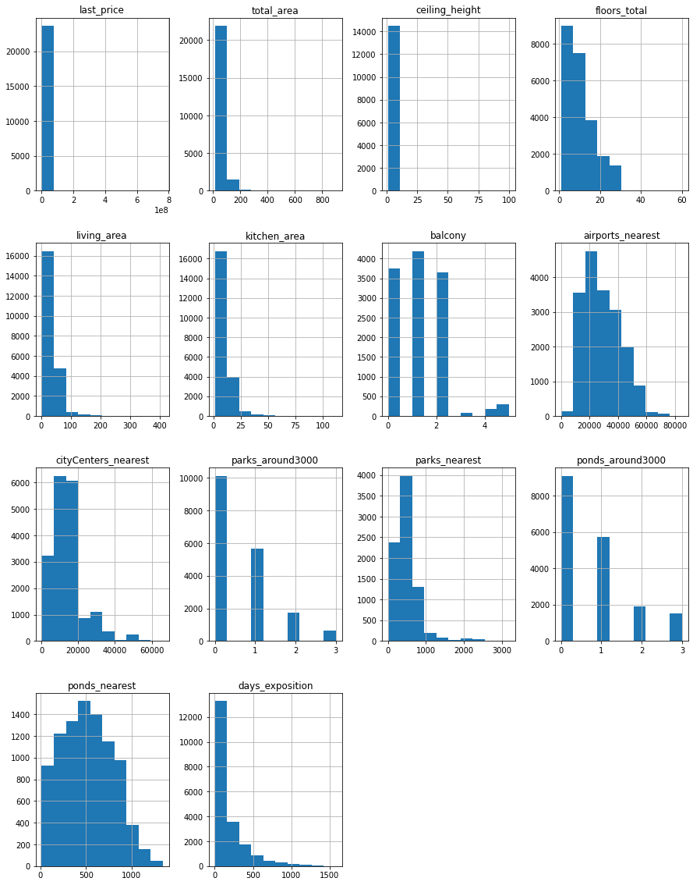
    


Анализ представленных числовых данных проведен ниже в других пунктах задания.


```python
#все на одном графике, как запрашивается в задании, выглядит неудобно и неинформативно за счет разного порядка числ
all_data.plot(kind='hist',figsize=(10, 10)) 
plt.show()

```


    
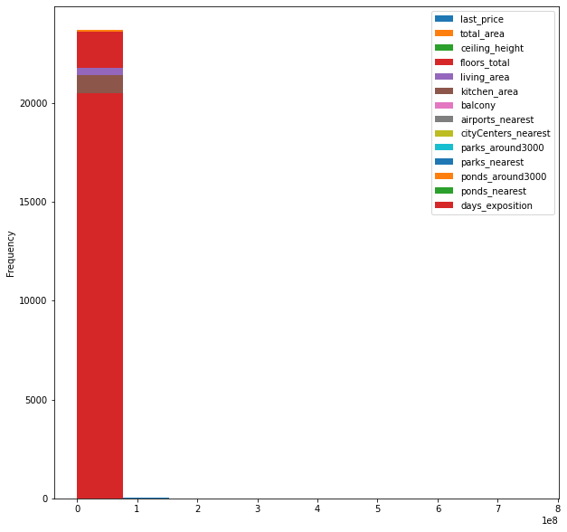
    


### Выполните предобработку данных


```python
#проверка всего пропусков
display('***Всего пропусков***',data.isna().sum()) 
pd.DataFrame(round(data.isna().mean()*100,1)).style.background_gradient('coolwarm')

```


    '***Всего пропусков***'


    total_images                0
    last_price                  0
    total_area                  0
    first_day_exposition        0
    rooms                       0
    ceiling_height           9195
    floors_total               86
    living_area              1903
    floor                       0
    is_apartment            20924
    studio                      0
    open_plan                   0
    kitchen_area             2278
    balcony                 11519
    locality_name              49
    airports_nearest         5542
    cityCenters_nearest      5519
    parks_around3000         5518
    parks_nearest           15620
    ponds_around3000         5518
    ponds_nearest           14589
    days_exposition          3181
    dtype: int64


<style  type="text/css" >
#T_51e01_row0_col0,#T_51e01_row1_col0,#T_51e01_row2_col0,#T_51e01_row3_col0,#T_51e01_row4_col0,#T_51e01_row8_col0,#T_51e01_row10_col0,#T_51e01_row11_col0,#T_51e01_row14_col0{
            background-color:  #3b4cc0;
            color:  #f1f1f1;
        }#T_51e01_row5_col0{
            background-color:  #ccd9ed;
            color:  #000000;
        }#T_51e01_row6_col0{
            background-color:  #3c4ec2;
            color:  #f1f1f1;
        }#T_51e01_row7_col0{
            background-color:  #5673e0;
            color:  #000000;
        }#T_51e01_row9_col0{
            background-color:  #b40426;
            color:  #f1f1f1;
        }#T_51e01_row12_col0{
            background-color:  #5b7ae5;
            color:  #000000;
        }#T_51e01_row13_col0{
            background-color:  #e9d5cb;
            color:  #000000;
        }#T_51e01_row15_col0,#T_51e01_row16_col0,#T_51e01_row17_col0,#T_51e01_row19_col0{
            background-color:  #92b4fe;
            color:  #000000;
        }#T_51e01_row18_col0{
            background-color:  #f49a7b;
            color:  #000000;
        }#T_51e01_row20_col0{
            background-color:  #f7ad90;
            color:  #000000;
        }#T_51e01_row21_col0{
            background-color:  #6a8bef;
            color:  #000000;
        }</style><table id="T_51e01_" ><thead>    <tr>        <th class="blank level0" ></th>        <th class="col_heading level0 col0" >0</th>    </tr></thead><tbody>
                <tr>
                        <th id="T_51e01_level0_row0" class="row_heading level0 row0" >total_images</th>
                        <td id="T_51e01_row0_col0" class="data row0 col0" >0.000000</td>
            </tr>
            <tr>
                        <th id="T_51e01_level0_row1" class="row_heading level0 row1" >last_price</th>
                        <td id="T_51e01_row1_col0" class="data row1 col0" >0.000000</td>
            </tr>
            <tr>
                        <th id="T_51e01_level0_row2" class="row_heading level0 row2" >total_area</th>
                        <td id="T_51e01_row2_col0" class="data row2 col0" >0.000000</td>
            </tr>
            <tr>
                        <th id="T_51e01_level0_row3" class="row_heading level0 row3" >first_day_exposition</th>
                        <td id="T_51e01_row3_col0" class="data row3 col0" >0.000000</td>
            </tr>
            <tr>
                        <th id="T_51e01_level0_row4" class="row_heading level0 row4" >rooms</th>
                        <td id="T_51e01_row4_col0" class="data row4 col0" >0.000000</td>
            </tr>
            <tr>
                        <th id="T_51e01_level0_row5" class="row_heading level0 row5" >ceiling_height</th>
                        <td id="T_51e01_row5_col0" class="data row5 col0" >38.800000</td>
            </tr>
            <tr>
                        <th id="T_51e01_level0_row6" class="row_heading level0 row6" >floors_total</th>
                        <td id="T_51e01_row6_col0" class="data row6 col0" >0.400000</td>
            </tr>
            <tr>
                        <th id="T_51e01_level0_row7" class="row_heading level0 row7" >living_area</th>
                        <td id="T_51e01_row7_col0" class="data row7 col0" >8.000000</td>
            </tr>
            <tr>
                        <th id="T_51e01_level0_row8" class="row_heading level0 row8" >floor</th>
                        <td id="T_51e01_row8_col0" class="data row8 col0" >0.000000</td>
            </tr>
            <tr>
                        <th id="T_51e01_level0_row9" class="row_heading level0 row9" >is_apartment</th>
                        <td id="T_51e01_row9_col0" class="data row9 col0" >88.300000</td>
            </tr>
            <tr>
                        <th id="T_51e01_level0_row10" class="row_heading level0 row10" >studio</th>
                        <td id="T_51e01_row10_col0" class="data row10 col0" >0.000000</td>
            </tr>
            <tr>
                        <th id="T_51e01_level0_row11" class="row_heading level0 row11" >open_plan</th>
                        <td id="T_51e01_row11_col0" class="data row11 col0" >0.000000</td>
            </tr>
            <tr>
                        <th id="T_51e01_level0_row12" class="row_heading level0 row12" >kitchen_area</th>
                        <td id="T_51e01_row12_col0" class="data row12 col0" >9.600000</td>
            </tr>
            <tr>
                        <th id="T_51e01_level0_row13" class="row_heading level0 row13" >balcony</th>
                        <td id="T_51e01_row13_col0" class="data row13 col0" >48.600000</td>
            </tr>
            <tr>
                        <th id="T_51e01_level0_row14" class="row_heading level0 row14" >locality_name</th>
                        <td id="T_51e01_row14_col0" class="data row14 col0" >0.200000</td>
            </tr>
            <tr>
                        <th id="T_51e01_level0_row15" class="row_heading level0 row15" >airports_nearest</th>
                        <td id="T_51e01_row15_col0" class="data row15 col0" >23.400000</td>
            </tr>
            <tr>
                        <th id="T_51e01_level0_row16" class="row_heading level0 row16" >cityCenters_nearest</th>
                        <td id="T_51e01_row16_col0" class="data row16 col0" >23.300000</td>
            </tr>
            <tr>
                        <th id="T_51e01_level0_row17" class="row_heading level0 row17" >parks_around3000</th>
                        <td id="T_51e01_row17_col0" class="data row17 col0" >23.300000</td>
            </tr>
            <tr>
                        <th id="T_51e01_level0_row18" class="row_heading level0 row18" >parks_nearest</th>
                        <td id="T_51e01_row18_col0" class="data row18 col0" >65.900000</td>
            </tr>
            <tr>
                        <th id="T_51e01_level0_row19" class="row_heading level0 row19" >ponds_around3000</th>
                        <td id="T_51e01_row19_col0" class="data row19 col0" >23.300000</td>
            </tr>
            <tr>
                        <th id="T_51e01_level0_row20" class="row_heading level0 row20" >ponds_nearest</th>
                        <td id="T_51e01_row20_col0" class="data row20 col0" >61.600000</td>
            </tr>
            <tr>
                        <th id="T_51e01_level0_row21" class="row_heading level0 row21" >days_exposition</th>
                        <td id="T_51e01_row21_col0" class="data row21 col0" >13.400000</td>
            </tr>
    </tbody></table>


```python
print(data.duplicated().sum())
```

    0


Явные дубликаты не найдены


```python
#заменила NaN на 0, так как вероятно кол-во балконов не заполнялось в случае их отсутствия
data['balcony'] = data['balcony'].fillna(0) 

#проверила уникальные значения в столбце апартаменты ли это
display('*Уникальные значения в столбце Апартаментов*', data['is_apartment'].value_counts())
#NaN скорее всего соответствует False 
data['is_apartment'] = data['is_apartment'].fillna(False)

#было предположение, что это совсем свежие объявления, которые не были закрыты, но в списке есть объявления от 14 года
display('*Позиции без продолжительности*',data.query('days_exposition.isna()').sort_values(by='first_day_exposition').head()) 
```


    '*Уникальные значения в столбце Апартаментов*'


    False    2725
    True       50
    Name: is_apartment, dtype: int64


    '*Позиции без продолжительности*'


<div>
<style scoped>
    .dataframe tbody tr th:only-of-type {
        vertical-align: middle;
    }

    .dataframe tbody tr th {
        vertical-align: top;
    }

    .dataframe thead th {
        text-align: right;
    }
</style>
<table border="1" class="dataframe">
  <thead>
    <tr style="text-align: right;">
      <th></th>
      <th>total_images</th>
      <th>last_price</th>
      <th>total_area</th>
      <th>first_day_exposition</th>
      <th>rooms</th>
      <th>ceiling_height</th>
      <th>floors_total</th>
      <th>living_area</th>
      <th>floor</th>
      <th>is_apartment</th>
      <th>...</th>
      <th>kitchen_area</th>
      <th>balcony</th>
      <th>locality_name</th>
      <th>airports_nearest</th>
      <th>cityCenters_nearest</th>
      <th>parks_around3000</th>
      <th>parks_nearest</th>
      <th>ponds_around3000</th>
      <th>ponds_nearest</th>
      <th>days_exposition</th>
    </tr>
  </thead>
  <tbody>
    <tr>
      <th>3873</th>
      <td>7</td>
      <td>20100000.0</td>
      <td>117.6</td>
      <td>2014-11-27T00:00:00</td>
      <td>3</td>
      <td>NaN</td>
      <td>8.0</td>
      <td>62.5</td>
      <td>7</td>
      <td>False</td>
      <td>...</td>
      <td>21.5</td>
      <td>0.0</td>
      <td>Санкт-Петербург</td>
      <td>39393.0</td>
      <td>11096.0</td>
      <td>1.0</td>
      <td>537.0</td>
      <td>0.0</td>
      <td>NaN</td>
      <td>NaN</td>
    </tr>
    <tr>
      <th>15857</th>
      <td>6</td>
      <td>25000000.0</td>
      <td>145.2</td>
      <td>2014-11-27T00:00:00</td>
      <td>3</td>
      <td>NaN</td>
      <td>5.0</td>
      <td>60.7</td>
      <td>5</td>
      <td>False</td>
      <td>...</td>
      <td>40.2</td>
      <td>0.0</td>
      <td>Санкт-Петербург</td>
      <td>36779.0</td>
      <td>14931.0</td>
      <td>0.0</td>
      <td>NaN</td>
      <td>0.0</td>
      <td>NaN</td>
      <td>NaN</td>
    </tr>
    <tr>
      <th>3291</th>
      <td>8</td>
      <td>8200000.0</td>
      <td>52.5</td>
      <td>2014-11-27T00:00:00</td>
      <td>1</td>
      <td>NaN</td>
      <td>8.0</td>
      <td>21.5</td>
      <td>2</td>
      <td>False</td>
      <td>...</td>
      <td>15.1</td>
      <td>0.0</td>
      <td>Санкт-Петербург</td>
      <td>39393.0</td>
      <td>11096.0</td>
      <td>1.0</td>
      <td>537.0</td>
      <td>0.0</td>
      <td>NaN</td>
      <td>NaN</td>
    </tr>
    <tr>
      <th>6922</th>
      <td>17</td>
      <td>29999000.0</td>
      <td>133.5</td>
      <td>2014-12-08T00:00:00</td>
      <td>3</td>
      <td>3.0</td>
      <td>15.0</td>
      <td>71.7</td>
      <td>12</td>
      <td>False</td>
      <td>...</td>
      <td>19.8</td>
      <td>2.0</td>
      <td>Санкт-Петербург</td>
      <td>31656.0</td>
      <td>8733.0</td>
      <td>1.0</td>
      <td>562.0</td>
      <td>1.0</td>
      <td>522.0</td>
      <td>NaN</td>
    </tr>
    <tr>
      <th>15614</th>
      <td>3</td>
      <td>19400000.0</td>
      <td>117.7</td>
      <td>2014-12-09T00:00:00</td>
      <td>3</td>
      <td>3.0</td>
      <td>8.0</td>
      <td>62.6</td>
      <td>5</td>
      <td>False</td>
      <td>...</td>
      <td>21.3</td>
      <td>0.0</td>
      <td>Санкт-Петербург</td>
      <td>39393.0</td>
      <td>11096.0</td>
      <td>1.0</td>
      <td>537.0</td>
      <td>0.0</td>
      <td>NaN</td>
      <td>NaN</td>
    </tr>
  </tbody>
</table>
<p>5 rows × 22 columns</p>
</div>


Заменила NaN на 0, так как вероятно кол-во балконов не заполнялось в случае их отсутствия. В случае апартаментов незаполненные NaN скорее всего соответствует False - то есть отрицальному ответу на название столбца.


```python
#изменила формат времени для наглядности и будующей работы со столбцом
data['first_day_exposition'] = pd.to_datetime(data['first_day_exposition'],format='%Y-%m-%dT%H:%M:%S')

```


```python
#изменила формат балконов на целый
data['balcony'] = data['balcony'].astype('int')

```


```python
#изменила формат этажей на целый
data['floors_total'] = data['floors_total'].fillna(0)
data['floors_total'] = data['floors_total'].astype('int')

```


```python
#создала новый столбец, чтобы не искажать данные в изначальном
data['floors_total_adj'] = data['floors_total'].fillna(0)
#кол-во этаже всего будет не меньше, чем этаж квартиры - для анализа
data.loc[data['floors_total_adj'] == 'None','floors_total_adj'] = data['floor']

```

Создала новый столбец, в котором все пропущенные значения в столбце этажности заменила на номер этажа, на котором находится квартира, так как значение в столбце этажности в любом случае не будет выше, а медиана может исказить данные в этом случае.


```python
#проверка уникальных значений в столбце parks_around3000
display('***Уникальные значения в столбце парков***', data['parks_around3000'].unique())

#пивот для проверки возможных искажений в парках
parks = data.pivot_table(index='locality_name',columns='parks_around3000',values='parks_nearest',aggfunc='sum')
display('***Пивот по наличию парков в населенных пунктах***', parks.head(10))
#ошибка в данных по СПБ, парков рядом 0, однако растояние до парков указано - всего 4 строки 
display('***Проверка ошибки в парках в СПБ***', data.query('parks_around3000 == 0 and (locality_name in "Санкт-Петербург" and parks_nearest>0)')) 
#изначально думала удалить строки, но потом решила оставить с целью полноты другой информации и 4 строки - несущественны
##wrong_parks = data.query('parks_around3000 == 0 and (locality_name in "Санкт-Петербург" and parks_nearest>0)') 
##data = data.drop(wrong_parks.index)

#поправила растояние до парка на 0 в 4х найденных строках, за эталон был взят столбец parks_around3000
data.loc[(data['parks_around3000'] == 0) & (data['locality_name'] != 'Санкт-Петербург'), 'parks_nearest'] = 0 
#поправила 8376 строк, по которым были пропуски в parks_nearest и 0 в parks_around3000
data.loc[(data['parks_nearest'].isna()) & (data['parks_around3000'] == 0), 'parks_nearest'] = 0 

```


    '***Уникальные значения в столбце парков***'


    array([ 1.,  0.,  2., nan,  3.])


    '***Пивот по наличию парков в населенных пунктах***'


<div>
<style scoped>
    .dataframe tbody tr th:only-of-type {
        vertical-align: middle;
    }

    .dataframe tbody tr th {
        vertical-align: top;
    }

    .dataframe thead th {
        text-align: right;
    }
</style>
<table border="1" class="dataframe">
  <thead>
    <tr style="text-align: right;">
      <th>parks_around3000</th>
      <th>0.0</th>
      <th>1.0</th>
      <th>2.0</th>
      <th>3.0</th>
    </tr>
    <tr>
      <th>locality_name</th>
      <th></th>
      <th></th>
      <th></th>
      <th></th>
    </tr>
  </thead>
  <tbody>
    <tr>
      <th>Зеленогорск</th>
      <td>0.0</td>
      <td>NaN</td>
      <td>1148.0</td>
      <td>2222.0</td>
    </tr>
    <tr>
      <th>Колпино</th>
      <td>0.0</td>
      <td>55322.0</td>
      <td>7878.0</td>
      <td>2699.0</td>
    </tr>
    <tr>
      <th>Красное Село</th>
      <td>0.0</td>
      <td>10435.0</td>
      <td>5941.0</td>
      <td>5064.0</td>
    </tr>
    <tr>
      <th>Кронштадт</th>
      <td>0.0</td>
      <td>12666.0</td>
      <td>10004.0</td>
      <td>5568.0</td>
    </tr>
    <tr>
      <th>Ломоносов</th>
      <td>0.0</td>
      <td>17.0</td>
      <td>5924.0</td>
      <td>284.0</td>
    </tr>
    <tr>
      <th>Павловск</th>
      <td>0.0</td>
      <td>3030.0</td>
      <td>3589.0</td>
      <td>3249.0</td>
    </tr>
    <tr>
      <th>Петергоф</th>
      <td>0.0</td>
      <td>40896.0</td>
      <td>6681.0</td>
      <td>12420.0</td>
    </tr>
    <tr>
      <th>Пушкин</th>
      <td>0.0</td>
      <td>71498.0</td>
      <td>8714.0</td>
      <td>5499.0</td>
    </tr>
    <tr>
      <th>Санкт-Петербург</th>
      <td>12457.0</td>
      <td>2872586.0</td>
      <td>584356.0</td>
      <td>162388.0</td>
    </tr>
    <tr>
      <th>Сестрорецк</th>
      <td>0.0</td>
      <td>19921.0</td>
      <td>7548.0</td>
      <td>2021.0</td>
    </tr>
  </tbody>
</table>
</div>


    '***Проверка ошибки в парках в СПБ***'


<div>
<style scoped>
    .dataframe tbody tr th:only-of-type {
        vertical-align: middle;
    }

    .dataframe tbody tr th {
        vertical-align: top;
    }

    .dataframe thead th {
        text-align: right;
    }
</style>
<table border="1" class="dataframe">
  <thead>
    <tr style="text-align: right;">
      <th></th>
      <th>total_images</th>
      <th>last_price</th>
      <th>total_area</th>
      <th>first_day_exposition</th>
      <th>rooms</th>
      <th>ceiling_height</th>
      <th>floors_total</th>
      <th>living_area</th>
      <th>floor</th>
      <th>is_apartment</th>
      <th>...</th>
      <th>balcony</th>
      <th>locality_name</th>
      <th>airports_nearest</th>
      <th>cityCenters_nearest</th>
      <th>parks_around3000</th>
      <th>parks_nearest</th>
      <th>ponds_around3000</th>
      <th>ponds_nearest</th>
      <th>days_exposition</th>
      <th>floors_total_adj</th>
    </tr>
  </thead>
  <tbody>
    <tr>
      <th>1590</th>
      <td>3</td>
      <td>7500000.0</td>
      <td>70.0</td>
      <td>2017-07-11</td>
      <td>2</td>
      <td>NaN</td>
      <td>18</td>
      <td>37.0</td>
      <td>13</td>
      <td>False</td>
      <td>...</td>
      <td>0</td>
      <td>Санкт-Петербург</td>
      <td>14878.0</td>
      <td>9791.0</td>
      <td>0.0</td>
      <td>3064.0</td>
      <td>1.0</td>
      <td>264.0</td>
      <td>4.0</td>
      <td>18</td>
    </tr>
    <tr>
      <th>10959</th>
      <td>9</td>
      <td>3000000.0</td>
      <td>31.1</td>
      <td>2017-03-21</td>
      <td>1</td>
      <td>NaN</td>
      <td>5</td>
      <td>17.7</td>
      <td>2</td>
      <td>False</td>
      <td>...</td>
      <td>0</td>
      <td>Санкт-Петербург</td>
      <td>14821.0</td>
      <td>9734.0</td>
      <td>0.0</td>
      <td>3190.0</td>
      <td>1.0</td>
      <td>431.0</td>
      <td>234.0</td>
      <td>5</td>
    </tr>
    <tr>
      <th>19208</th>
      <td>17</td>
      <td>14950000.0</td>
      <td>187.0</td>
      <td>2017-10-12</td>
      <td>5</td>
      <td>3.0</td>
      <td>2</td>
      <td>80.0</td>
      <td>2</td>
      <td>False</td>
      <td>...</td>
      <td>1</td>
      <td>Санкт-Петербург</td>
      <td>36805.0</td>
      <td>8656.0</td>
      <td>0.0</td>
      <td>3013.0</td>
      <td>3.0</td>
      <td>537.0</td>
      <td>49.0</td>
      <td>2</td>
    </tr>
    <tr>
      <th>19430</th>
      <td>9</td>
      <td>3900000.0</td>
      <td>30.5</td>
      <td>2018-02-22</td>
      <td>1</td>
      <td>2.6</td>
      <td>5</td>
      <td>16.5</td>
      <td>1</td>
      <td>False</td>
      <td>...</td>
      <td>0</td>
      <td>Санкт-Петербург</td>
      <td>14821.0</td>
      <td>9734.0</td>
      <td>0.0</td>
      <td>3190.0</td>
      <td>1.0</td>
      <td>431.0</td>
      <td>176.0</td>
      <td>5</td>
    </tr>
  </tbody>
</table>
<p>4 rows × 23 columns</p>
</div>


Благодаря пивоту по наличию парков в населенных пунктах было выявлено несоответствие столбцов parks_around3000 и parks_nearest, отсутствие парков вокруг соответствовало расстоянию до ближайших парков. Данные в этих 4 строках в столбце parks_nearest были заменены на 0. Также заменила пропуски в parks_nearest на 0, где кол-во парков вокруг соответствовало 0. Принимая 0 в parks_nearest за отсутствие парков, так как изначально мин число в данном столбце = 1, то есть в парках никто не живет, путаницы не будет.


```python
#определили уникальные значения
print(data['ponds_around3000'].unique())
#проверила, что нет данных, где число водоёмов =0, а растояние больше нуля
print('Кол-во строк, где число водоемов = 0, но есть значения в столбце водоемов рядом: ', len(data.query('ponds_around3000 == 0 and ponds_nearest>0')))
#Nan заменила на 0 в столбце радиуса по водоемам, по которым было 0 в кол=ве
data.loc[(data['ponds_around3000'] == 0), 'ponds_nearest'] = 0 
#проверили, что все NaN в кол-ве водоемов имеют NaN в радиусе, всего строк 5518, что равно кол-ву NaN в проверке всего датафрейма
print('Проверка совпадения пропусков в парках вокруг и парков рядом: ', len(data.query('ponds_around3000.isna() and ponds_nearest.isna()')))
```

    [ 2.  0.  3.  1. nan]
    Кол-во строк, где число водоемов = 0, но есть значения в столбце водоемов рядом:  0
    Проверка совпадения пропусков в парках вокруг и парков рядом:  5518


То же самое сделала с водоемами. Принимая 0 в ponds_nearest за отсутствие парков, так как изначально мин число в данном столбце = 13, то есть в прудах также никто не живет, путаницы не будет.


```python
#проверили позиции без локации - 49 строк было
display('*Строки без локации*', data.query('locality_name.isna()').head())
#заменили на 'Локация_не_определена', так как определить локацию по косвенным признакам не получилось
data['locality_name'] = data['locality_name'].fillna('Локация_не_определена') 
display(data.query('locality_name == "Локация_не_определена"').head()) #для проверки

```


    '*Строки без локации*'


<div>
<style scoped>
    .dataframe tbody tr th:only-of-type {
        vertical-align: middle;
    }

    .dataframe tbody tr th {
        vertical-align: top;
    }

    .dataframe thead th {
        text-align: right;
    }
</style>
<table border="1" class="dataframe">
  <thead>
    <tr style="text-align: right;">
      <th></th>
      <th>total_images</th>
      <th>last_price</th>
      <th>total_area</th>
      <th>first_day_exposition</th>
      <th>rooms</th>
      <th>ceiling_height</th>
      <th>floors_total</th>
      <th>living_area</th>
      <th>floor</th>
      <th>is_apartment</th>
      <th>...</th>
      <th>balcony</th>
      <th>locality_name</th>
      <th>airports_nearest</th>
      <th>cityCenters_nearest</th>
      <th>parks_around3000</th>
      <th>parks_nearest</th>
      <th>ponds_around3000</th>
      <th>ponds_nearest</th>
      <th>days_exposition</th>
      <th>floors_total_adj</th>
    </tr>
  </thead>
  <tbody>
    <tr>
      <th>1097</th>
      <td>3</td>
      <td>8600000.0</td>
      <td>81.7</td>
      <td>2016-04-15</td>
      <td>3</td>
      <td>3.55</td>
      <td>5</td>
      <td>50.8</td>
      <td>2</td>
      <td>False</td>
      <td>...</td>
      <td>0</td>
      <td>NaN</td>
      <td>23478.0</td>
      <td>4258.0</td>
      <td>0.0</td>
      <td>0.0</td>
      <td>0.0</td>
      <td>0.0</td>
      <td>147.0</td>
      <td>5</td>
    </tr>
    <tr>
      <th>2033</th>
      <td>6</td>
      <td>5398000.0</td>
      <td>80.0</td>
      <td>2017-05-30</td>
      <td>3</td>
      <td>NaN</td>
      <td>4</td>
      <td>42.6</td>
      <td>2</td>
      <td>False</td>
      <td>...</td>
      <td>0</td>
      <td>NaN</td>
      <td>NaN</td>
      <td>NaN</td>
      <td>NaN</td>
      <td>NaN</td>
      <td>NaN</td>
      <td>NaN</td>
      <td>34.0</td>
      <td>4</td>
    </tr>
    <tr>
      <th>2603</th>
      <td>20</td>
      <td>3351765.0</td>
      <td>42.7</td>
      <td>2015-09-20</td>
      <td>1</td>
      <td>NaN</td>
      <td>24</td>
      <td>15.6</td>
      <td>3</td>
      <td>False</td>
      <td>...</td>
      <td>0</td>
      <td>NaN</td>
      <td>22041.0</td>
      <td>17369.0</td>
      <td>0.0</td>
      <td>0.0</td>
      <td>1.0</td>
      <td>374.0</td>
      <td>276.0</td>
      <td>24</td>
    </tr>
    <tr>
      <th>2632</th>
      <td>2</td>
      <td>5130593.0</td>
      <td>62.4</td>
      <td>2015-10-11</td>
      <td>2</td>
      <td>NaN</td>
      <td>24</td>
      <td>33.1</td>
      <td>21</td>
      <td>False</td>
      <td>...</td>
      <td>0</td>
      <td>NaN</td>
      <td>22041.0</td>
      <td>17369.0</td>
      <td>0.0</td>
      <td>0.0</td>
      <td>1.0</td>
      <td>374.0</td>
      <td>256.0</td>
      <td>24</td>
    </tr>
    <tr>
      <th>3574</th>
      <td>10</td>
      <td>4200000.0</td>
      <td>46.5</td>
      <td>2016-05-28</td>
      <td>2</td>
      <td>NaN</td>
      <td>5</td>
      <td>30.8</td>
      <td>5</td>
      <td>False</td>
      <td>...</td>
      <td>0</td>
      <td>NaN</td>
      <td>27419.0</td>
      <td>8127.0</td>
      <td>0.0</td>
      <td>0.0</td>
      <td>1.0</td>
      <td>603.0</td>
      <td>45.0</td>
      <td>5</td>
    </tr>
  </tbody>
</table>
<p>5 rows × 23 columns</p>
</div>


<div>
<style scoped>
    .dataframe tbody tr th:only-of-type {
        vertical-align: middle;
    }

    .dataframe tbody tr th {
        vertical-align: top;
    }

    .dataframe thead th {
        text-align: right;
    }
</style>
<table border="1" class="dataframe">
  <thead>
    <tr style="text-align: right;">
      <th></th>
      <th>total_images</th>
      <th>last_price</th>
      <th>total_area</th>
      <th>first_day_exposition</th>
      <th>rooms</th>
      <th>ceiling_height</th>
      <th>floors_total</th>
      <th>living_area</th>
      <th>floor</th>
      <th>is_apartment</th>
      <th>...</th>
      <th>balcony</th>
      <th>locality_name</th>
      <th>airports_nearest</th>
      <th>cityCenters_nearest</th>
      <th>parks_around3000</th>
      <th>parks_nearest</th>
      <th>ponds_around3000</th>
      <th>ponds_nearest</th>
      <th>days_exposition</th>
      <th>floors_total_adj</th>
    </tr>
  </thead>
  <tbody>
    <tr>
      <th>1097</th>
      <td>3</td>
      <td>8600000.0</td>
      <td>81.7</td>
      <td>2016-04-15</td>
      <td>3</td>
      <td>3.55</td>
      <td>5</td>
      <td>50.8</td>
      <td>2</td>
      <td>False</td>
      <td>...</td>
      <td>0</td>
      <td>Локация_не_определена</td>
      <td>23478.0</td>
      <td>4258.0</td>
      <td>0.0</td>
      <td>0.0</td>
      <td>0.0</td>
      <td>0.0</td>
      <td>147.0</td>
      <td>5</td>
    </tr>
    <tr>
      <th>2033</th>
      <td>6</td>
      <td>5398000.0</td>
      <td>80.0</td>
      <td>2017-05-30</td>
      <td>3</td>
      <td>NaN</td>
      <td>4</td>
      <td>42.6</td>
      <td>2</td>
      <td>False</td>
      <td>...</td>
      <td>0</td>
      <td>Локация_не_определена</td>
      <td>NaN</td>
      <td>NaN</td>
      <td>NaN</td>
      <td>NaN</td>
      <td>NaN</td>
      <td>NaN</td>
      <td>34.0</td>
      <td>4</td>
    </tr>
    <tr>
      <th>2603</th>
      <td>20</td>
      <td>3351765.0</td>
      <td>42.7</td>
      <td>2015-09-20</td>
      <td>1</td>
      <td>NaN</td>
      <td>24</td>
      <td>15.6</td>
      <td>3</td>
      <td>False</td>
      <td>...</td>
      <td>0</td>
      <td>Локация_не_определена</td>
      <td>22041.0</td>
      <td>17369.0</td>
      <td>0.0</td>
      <td>0.0</td>
      <td>1.0</td>
      <td>374.0</td>
      <td>276.0</td>
      <td>24</td>
    </tr>
    <tr>
      <th>2632</th>
      <td>2</td>
      <td>5130593.0</td>
      <td>62.4</td>
      <td>2015-10-11</td>
      <td>2</td>
      <td>NaN</td>
      <td>24</td>
      <td>33.1</td>
      <td>21</td>
      <td>False</td>
      <td>...</td>
      <td>0</td>
      <td>Локация_не_определена</td>
      <td>22041.0</td>
      <td>17369.0</td>
      <td>0.0</td>
      <td>0.0</td>
      <td>1.0</td>
      <td>374.0</td>
      <td>256.0</td>
      <td>24</td>
    </tr>
    <tr>
      <th>3574</th>
      <td>10</td>
      <td>4200000.0</td>
      <td>46.5</td>
      <td>2016-05-28</td>
      <td>2</td>
      <td>NaN</td>
      <td>5</td>
      <td>30.8</td>
      <td>5</td>
      <td>False</td>
      <td>...</td>
      <td>0</td>
      <td>Локация_не_определена</td>
      <td>27419.0</td>
      <td>8127.0</td>
      <td>0.0</td>
      <td>0.0</td>
      <td>1.0</td>
      <td>603.0</td>
      <td>45.0</td>
      <td>5</td>
    </tr>
  </tbody>
</table>
<p>5 rows × 23 columns</p>
</div>


```python
#Создала переменную, в которую поместила сред по NaN в парках, аэропортах, прудах и центрах
strange_rows = data.query('cityCenters_nearest.isna() and airports_nearest.isna() and parks_around3000.isna() and ponds_around3000.isna()')
display('*Подозрительные строки*',strange_rows.head())

```


    '*Подозрительные строки*'


<div>
<style scoped>
    .dataframe tbody tr th:only-of-type {
        vertical-align: middle;
    }

    .dataframe tbody tr th {
        vertical-align: top;
    }

    .dataframe thead th {
        text-align: right;
    }
</style>
<table border="1" class="dataframe">
  <thead>
    <tr style="text-align: right;">
      <th></th>
      <th>total_images</th>
      <th>last_price</th>
      <th>total_area</th>
      <th>first_day_exposition</th>
      <th>rooms</th>
      <th>ceiling_height</th>
      <th>floors_total</th>
      <th>living_area</th>
      <th>floor</th>
      <th>is_apartment</th>
      <th>...</th>
      <th>balcony</th>
      <th>locality_name</th>
      <th>airports_nearest</th>
      <th>cityCenters_nearest</th>
      <th>parks_around3000</th>
      <th>parks_nearest</th>
      <th>ponds_around3000</th>
      <th>ponds_nearest</th>
      <th>days_exposition</th>
      <th>floors_total_adj</th>
    </tr>
  </thead>
  <tbody>
    <tr>
      <th>5</th>
      <td>10</td>
      <td>2890000.0</td>
      <td>30.40</td>
      <td>2018-09-10</td>
      <td>1</td>
      <td>NaN</td>
      <td>12</td>
      <td>14.40</td>
      <td>5</td>
      <td>False</td>
      <td>...</td>
      <td>0</td>
      <td>городской посёлок Янино-1</td>
      <td>NaN</td>
      <td>NaN</td>
      <td>NaN</td>
      <td>NaN</td>
      <td>NaN</td>
      <td>NaN</td>
      <td>55.0</td>
      <td>12</td>
    </tr>
    <tr>
      <th>8</th>
      <td>20</td>
      <td>2900000.0</td>
      <td>33.16</td>
      <td>2018-05-23</td>
      <td>1</td>
      <td>NaN</td>
      <td>27</td>
      <td>15.43</td>
      <td>26</td>
      <td>False</td>
      <td>...</td>
      <td>0</td>
      <td>посёлок Мурино</td>
      <td>NaN</td>
      <td>NaN</td>
      <td>NaN</td>
      <td>NaN</td>
      <td>NaN</td>
      <td>NaN</td>
      <td>189.0</td>
      <td>27</td>
    </tr>
    <tr>
      <th>12</th>
      <td>10</td>
      <td>3890000.0</td>
      <td>54.00</td>
      <td>2016-06-30</td>
      <td>2</td>
      <td>NaN</td>
      <td>5</td>
      <td>30.00</td>
      <td>5</td>
      <td>False</td>
      <td>...</td>
      <td>0</td>
      <td>Сертолово</td>
      <td>NaN</td>
      <td>NaN</td>
      <td>NaN</td>
      <td>NaN</td>
      <td>NaN</td>
      <td>NaN</td>
      <td>90.0</td>
      <td>5</td>
    </tr>
    <tr>
      <th>22</th>
      <td>20</td>
      <td>5000000.0</td>
      <td>58.00</td>
      <td>2017-04-24</td>
      <td>2</td>
      <td>2.75</td>
      <td>25</td>
      <td>30.00</td>
      <td>15</td>
      <td>False</td>
      <td>...</td>
      <td>2</td>
      <td>деревня Кудрово</td>
      <td>NaN</td>
      <td>NaN</td>
      <td>NaN</td>
      <td>NaN</td>
      <td>NaN</td>
      <td>NaN</td>
      <td>60.0</td>
      <td>25</td>
    </tr>
    <tr>
      <th>30</th>
      <td>12</td>
      <td>2200000.0</td>
      <td>32.80</td>
      <td>2018-02-19</td>
      <td>1</td>
      <td>NaN</td>
      <td>9</td>
      <td>NaN</td>
      <td>2</td>
      <td>False</td>
      <td>...</td>
      <td>0</td>
      <td>Коммунар</td>
      <td>NaN</td>
      <td>NaN</td>
      <td>NaN</td>
      <td>NaN</td>
      <td>NaN</td>
      <td>NaN</td>
      <td>63.0</td>
      <td>9</td>
    </tr>
  </tbody>
</table>
<p>5 rows × 23 columns</p>
</div>


Оставшиеся объекты в кол-ве 5518 штук, по которым нет иформации ни о парках, ни о прудах не удаляла и не меняла их, но объединила в срез подозрительные строки. Подозрительные строки не трогала и не заполняла, данные позиции вносятся в систему автоматически согласно информации выше, заполнять их медианой не имеет смысла для анализа - они будут средними из средних. Не учитываю эти строки в анализе пропущенных параметров. 


```python
#вывела строку, которая не относится к strange_rows
display('*NaN центров города из числа неподозрительных строк*',data.query('cityCenters_nearest.isna() and parks_around3000>=0')) 
#посмотрели на разброс цифр в Пушкине, чтобы понять чем заменить пропуск
display('*Пушкин по удаленности от центра*',data.query('locality_name == "Пушкин"').sort_values(by='cityCenters_nearest').head()) 
#вместо одного NaN поставила медианное значение
data.loc[(data['cityCenters_nearest'].isna()) & (data['parks_around3000'] >= 0), 'cityCenters_nearest'] = data.query('locality_name == "Пушкин"')['cityCenters_nearest'].median()

#все аэропорты, которые не относятся к strange_rows, в СПБ
display('*NaN аэропортов из числа неподозрительных строк*',data.query('airports_nearest.isna() and parks_around3000>=0').head()) 
#слишком большой разброс по удаленности, не правила данные оставила как есть - NaN
display('*СПБ по удаленности аэропортов*',data.query('locality_name == "Санкт-Петербург" and airports_nearest>0').sort_values(by='airports_nearest').head()) 
display('*СПБ описание значениий строк*',data.query('locality_name == "Санкт-Петербург" and airports_nearest>0')['airports_nearest'].describe())

```


    '*NaN центров города из числа неподозрительных строк*'


<div>
<style scoped>
    .dataframe tbody tr th:only-of-type {
        vertical-align: middle;
    }

    .dataframe tbody tr th {
        vertical-align: top;
    }

    .dataframe thead th {
        text-align: right;
    }
</style>
<table border="1" class="dataframe">
  <thead>
    <tr style="text-align: right;">
      <th></th>
      <th>total_images</th>
      <th>last_price</th>
      <th>total_area</th>
      <th>first_day_exposition</th>
      <th>rooms</th>
      <th>ceiling_height</th>
      <th>floors_total</th>
      <th>living_area</th>
      <th>floor</th>
      <th>is_apartment</th>
      <th>...</th>
      <th>balcony</th>
      <th>locality_name</th>
      <th>airports_nearest</th>
      <th>cityCenters_nearest</th>
      <th>parks_around3000</th>
      <th>parks_nearest</th>
      <th>ponds_around3000</th>
      <th>ponds_nearest</th>
      <th>days_exposition</th>
      <th>floors_total_adj</th>
    </tr>
  </thead>
  <tbody>
    <tr>
      <th>20190</th>
      <td>2</td>
      <td>10500000.0</td>
      <td>85.0</td>
      <td>2019-01-08</td>
      <td>3</td>
      <td>3.0</td>
      <td>3</td>
      <td>55.5</td>
      <td>2</td>
      <td>False</td>
      <td>...</td>
      <td>1</td>
      <td>Пушкин</td>
      <td>15527.0</td>
      <td>NaN</td>
      <td>1.0</td>
      <td>134.0</td>
      <td>0.0</td>
      <td>0.0</td>
      <td>NaN</td>
      <td>3</td>
    </tr>
  </tbody>
</table>
<p>1 rows × 23 columns</p>
</div>


    '*Пушкин по удаленности от центра*'


<div>
<style scoped>
    .dataframe tbody tr th:only-of-type {
        vertical-align: middle;
    }

    .dataframe tbody tr th {
        vertical-align: top;
    }

    .dataframe thead th {
        text-align: right;
    }
</style>
<table border="1" class="dataframe">
  <thead>
    <tr style="text-align: right;">
      <th></th>
      <th>total_images</th>
      <th>last_price</th>
      <th>total_area</th>
      <th>first_day_exposition</th>
      <th>rooms</th>
      <th>ceiling_height</th>
      <th>floors_total</th>
      <th>living_area</th>
      <th>floor</th>
      <th>is_apartment</th>
      <th>...</th>
      <th>balcony</th>
      <th>locality_name</th>
      <th>airports_nearest</th>
      <th>cityCenters_nearest</th>
      <th>parks_around3000</th>
      <th>parks_nearest</th>
      <th>ponds_around3000</th>
      <th>ponds_nearest</th>
      <th>days_exposition</th>
      <th>floors_total_adj</th>
    </tr>
  </thead>
  <tbody>
    <tr>
      <th>2354</th>
      <td>1</td>
      <td>3500000.0</td>
      <td>36.8</td>
      <td>2017-11-02</td>
      <td>1</td>
      <td>2.5</td>
      <td>9</td>
      <td>18.6</td>
      <td>5</td>
      <td>False</td>
      <td>...</td>
      <td>1</td>
      <td>Пушкин</td>
      <td>12157.0</td>
      <td>24311.0</td>
      <td>1.0</td>
      <td>94.0</td>
      <td>1.0</td>
      <td>1025.0</td>
      <td>130.0</td>
      <td>9</td>
    </tr>
    <tr>
      <th>21640</th>
      <td>18</td>
      <td>3500000.0</td>
      <td>35.2</td>
      <td>2017-01-24</td>
      <td>1</td>
      <td>NaN</td>
      <td>5</td>
      <td>14.0</td>
      <td>3</td>
      <td>False</td>
      <td>...</td>
      <td>1</td>
      <td>Пушкин</td>
      <td>12383.0</td>
      <td>24537.0</td>
      <td>1.0</td>
      <td>630.0</td>
      <td>0.0</td>
      <td>0.0</td>
      <td>56.0</td>
      <td>5</td>
    </tr>
    <tr>
      <th>20813</th>
      <td>3</td>
      <td>6200000.0</td>
      <td>72.5</td>
      <td>2017-07-20</td>
      <td>3</td>
      <td>NaN</td>
      <td>6</td>
      <td>41.0</td>
      <td>2</td>
      <td>False</td>
      <td>...</td>
      <td>2</td>
      <td>Пушкин</td>
      <td>12391.0</td>
      <td>24545.0</td>
      <td>1.0</td>
      <td>122.0</td>
      <td>1.0</td>
      <td>565.0</td>
      <td>58.0</td>
      <td>6</td>
    </tr>
    <tr>
      <th>5167</th>
      <td>19</td>
      <td>9973000.0</td>
      <td>88.0</td>
      <td>2017-12-21</td>
      <td>3</td>
      <td>2.8</td>
      <td>4</td>
      <td>50.0</td>
      <td>3</td>
      <td>False</td>
      <td>...</td>
      <td>0</td>
      <td>Пушкин</td>
      <td>12489.0</td>
      <td>24643.0</td>
      <td>1.0</td>
      <td>690.0</td>
      <td>0.0</td>
      <td>0.0</td>
      <td>7.0</td>
      <td>4</td>
    </tr>
    <tr>
      <th>6644</th>
      <td>15</td>
      <td>3899000.0</td>
      <td>38.0</td>
      <td>2017-04-27</td>
      <td>1</td>
      <td>NaN</td>
      <td>4</td>
      <td>18.0</td>
      <td>1</td>
      <td>False</td>
      <td>...</td>
      <td>0</td>
      <td>Пушкин</td>
      <td>12489.0</td>
      <td>24643.0</td>
      <td>1.0</td>
      <td>690.0</td>
      <td>0.0</td>
      <td>0.0</td>
      <td>67.0</td>
      <td>4</td>
    </tr>
  </tbody>
</table>
<p>5 rows × 23 columns</p>
</div>


    '*NaN аэропортов из числа неподозрительных строк*'


<div>
<style scoped>
    .dataframe tbody tr th:only-of-type {
        vertical-align: middle;
    }

    .dataframe tbody tr th {
        vertical-align: top;
    }

    .dataframe thead th {
        text-align: right;
    }
</style>
<table border="1" class="dataframe">
  <thead>
    <tr style="text-align: right;">
      <th></th>
      <th>total_images</th>
      <th>last_price</th>
      <th>total_area</th>
      <th>first_day_exposition</th>
      <th>rooms</th>
      <th>ceiling_height</th>
      <th>floors_total</th>
      <th>living_area</th>
      <th>floor</th>
      <th>is_apartment</th>
      <th>...</th>
      <th>balcony</th>
      <th>locality_name</th>
      <th>airports_nearest</th>
      <th>cityCenters_nearest</th>
      <th>parks_around3000</th>
      <th>parks_nearest</th>
      <th>ponds_around3000</th>
      <th>ponds_nearest</th>
      <th>days_exposition</th>
      <th>floors_total_adj</th>
    </tr>
  </thead>
  <tbody>
    <tr>
      <th>733</th>
      <td>18</td>
      <td>18700000.0</td>
      <td>109.7</td>
      <td>2018-02-03</td>
      <td>3</td>
      <td>2.75</td>
      <td>21</td>
      <td>57.2</td>
      <td>13</td>
      <td>False</td>
      <td>...</td>
      <td>1</td>
      <td>Санкт-Петербург</td>
      <td>NaN</td>
      <td>13355.0</td>
      <td>1.0</td>
      <td>735.0</td>
      <td>0.0</td>
      <td>0.0</td>
      <td>112.0</td>
      <td>21</td>
    </tr>
    <tr>
      <th>974</th>
      <td>8</td>
      <td>25897000.0</td>
      <td>149.0</td>
      <td>2018-03-26</td>
      <td>4</td>
      <td>2.74</td>
      <td>7</td>
      <td>NaN</td>
      <td>6</td>
      <td>False</td>
      <td>...</td>
      <td>0</td>
      <td>Санкт-Петербург</td>
      <td>NaN</td>
      <td>9734.0</td>
      <td>2.0</td>
      <td>469.0</td>
      <td>3.0</td>
      <td>263.0</td>
      <td>90.0</td>
      <td>7</td>
    </tr>
    <tr>
      <th>2415</th>
      <td>17</td>
      <td>9500000.0</td>
      <td>67.4</td>
      <td>2017-04-15</td>
      <td>2</td>
      <td>2.80</td>
      <td>23</td>
      <td>37.6</td>
      <td>4</td>
      <td>False</td>
      <td>...</td>
      <td>0</td>
      <td>Санкт-Петербург</td>
      <td>NaN</td>
      <td>13355.0</td>
      <td>1.0</td>
      <td>735.0</td>
      <td>0.0</td>
      <td>0.0</td>
      <td>56.0</td>
      <td>23</td>
    </tr>
    <tr>
      <th>7521</th>
      <td>16</td>
      <td>43500000.0</td>
      <td>245.8</td>
      <td>2015-12-17</td>
      <td>3</td>
      <td>4.45</td>
      <td>7</td>
      <td>170.8</td>
      <td>7</td>
      <td>True</td>
      <td>...</td>
      <td>1</td>
      <td>Санкт-Петербург</td>
      <td>NaN</td>
      <td>5735.0</td>
      <td>2.0</td>
      <td>110.0</td>
      <td>0.0</td>
      <td>0.0</td>
      <td>1067.0</td>
      <td>7</td>
    </tr>
    <tr>
      <th>7542</th>
      <td>10</td>
      <td>6900000.0</td>
      <td>50.0</td>
      <td>2016-03-17</td>
      <td>1</td>
      <td>2.80</td>
      <td>23</td>
      <td>20.0</td>
      <td>12</td>
      <td>False</td>
      <td>...</td>
      <td>0</td>
      <td>Санкт-Петербург</td>
      <td>NaN</td>
      <td>13355.0</td>
      <td>1.0</td>
      <td>735.0</td>
      <td>0.0</td>
      <td>0.0</td>
      <td>317.0</td>
      <td>23</td>
    </tr>
  </tbody>
</table>
<p>5 rows × 23 columns</p>
</div>


    '*СПБ по удаленности аэропортов*'


<div>
<style scoped>
    .dataframe tbody tr th:only-of-type {
        vertical-align: middle;
    }

    .dataframe tbody tr th {
        vertical-align: top;
    }

    .dataframe thead th {
        text-align: right;
    }
</style>
<table border="1" class="dataframe">
  <thead>
    <tr style="text-align: right;">
      <th></th>
      <th>total_images</th>
      <th>last_price</th>
      <th>total_area</th>
      <th>first_day_exposition</th>
      <th>rooms</th>
      <th>ceiling_height</th>
      <th>floors_total</th>
      <th>living_area</th>
      <th>floor</th>
      <th>is_apartment</th>
      <th>...</th>
      <th>balcony</th>
      <th>locality_name</th>
      <th>airports_nearest</th>
      <th>cityCenters_nearest</th>
      <th>parks_around3000</th>
      <th>parks_nearest</th>
      <th>ponds_around3000</th>
      <th>ponds_nearest</th>
      <th>days_exposition</th>
      <th>floors_total_adj</th>
    </tr>
  </thead>
  <tbody>
    <tr>
      <th>4017</th>
      <td>7</td>
      <td>2268000.0</td>
      <td>35.0</td>
      <td>2017-12-21</td>
      <td>1</td>
      <td>NaN</td>
      <td>9</td>
      <td>14.0</td>
      <td>6</td>
      <td>False</td>
      <td>...</td>
      <td>0</td>
      <td>Санкт-Петербург</td>
      <td>6450.0</td>
      <td>17461.0</td>
      <td>0.0</td>
      <td>0.0</td>
      <td>1.0</td>
      <td>444.0</td>
      <td>25.0</td>
      <td>9</td>
    </tr>
    <tr>
      <th>12899</th>
      <td>8</td>
      <td>4199000.0</td>
      <td>56.0</td>
      <td>2017-12-21</td>
      <td>2</td>
      <td>NaN</td>
      <td>9</td>
      <td>27.0</td>
      <td>5</td>
      <td>False</td>
      <td>...</td>
      <td>0</td>
      <td>Санкт-Петербург</td>
      <td>6450.0</td>
      <td>17461.0</td>
      <td>0.0</td>
      <td>0.0</td>
      <td>1.0</td>
      <td>444.0</td>
      <td>24.0</td>
      <td>9</td>
    </tr>
    <tr>
      <th>7778</th>
      <td>9</td>
      <td>2750000.0</td>
      <td>29.0</td>
      <td>2017-02-19</td>
      <td>1</td>
      <td>2.5</td>
      <td>4</td>
      <td>15.0</td>
      <td>1</td>
      <td>False</td>
      <td>...</td>
      <td>0</td>
      <td>Санкт-Петербург</td>
      <td>6914.0</td>
      <td>21486.0</td>
      <td>1.0</td>
      <td>215.0</td>
      <td>0.0</td>
      <td>0.0</td>
      <td>43.0</td>
      <td>4</td>
    </tr>
    <tr>
      <th>23150</th>
      <td>3</td>
      <td>6490000.0</td>
      <td>62.5</td>
      <td>2015-03-18</td>
      <td>2</td>
      <td>NaN</td>
      <td>24</td>
      <td>33.5</td>
      <td>15</td>
      <td>False</td>
      <td>...</td>
      <td>4</td>
      <td>Санкт-Петербург</td>
      <td>6949.0</td>
      <td>13165.0</td>
      <td>1.0</td>
      <td>711.0</td>
      <td>0.0</td>
      <td>0.0</td>
      <td>917.0</td>
      <td>24</td>
    </tr>
    <tr>
      <th>15633</th>
      <td>4</td>
      <td>6420000.0</td>
      <td>67.0</td>
      <td>2015-09-18</td>
      <td>2</td>
      <td>NaN</td>
      <td>24</td>
      <td>38.0</td>
      <td>11</td>
      <td>False</td>
      <td>...</td>
      <td>1</td>
      <td>Санкт-Петербург</td>
      <td>6989.0</td>
      <td>13205.0</td>
      <td>1.0</td>
      <td>535.0</td>
      <td>0.0</td>
      <td>0.0</td>
      <td>311.0</td>
      <td>24</td>
    </tr>
  </tbody>
</table>
<p>5 rows × 23 columns</p>
</div>


    '*СПБ описание значениий строк*'


    count    15635.000000
    mean     28047.980045
    std      11555.256446
    min       6450.000000
    25%      18585.000000
    50%      26758.000000
    75%      36614.000000
    max      54784.000000
    Name: airports_nearest, dtype: float64


Вне подозрительных строк была обнаружена позиция без удаленности от центра города в Пушкине - заполнила ее медианой. Тоже самое планировала сделать с аэропортами, но разброс данных был очень большой, поэтому не заполняла. Для анализа отдельно данных параметров медианные заполненные значения не повлияют на анализ.


```python
#Заменили NaN в столбце living_area
data.loc[data['living_area'].isna(), 'living_area'] = (data.query('living_area >0')['living_area'].median()/data.query('living_area >0')['total_area'].median())*data['total_area']
#Заменили NaN в столбце kitchen_area
data.loc[data['kitchen_area'].isna(), 'kitchen_area'] = (data.query('kitchen_area >0')['kitchen_area'].median()/data.query('kitchen_area >0')['total_area'].median())*data['total_area']
```

Жилая площадь и площадь кухни так или иначе будет зависеть от общей площади. Общая площадь точно будет включать в себя и жилую площадь и кухонную зону и балконы с коридорами и сан.узлами. Поэтому пропуски были заполнены в пропорции к общей площади. Доли кухни к общей площади и жилой площади к общей площади были получена на основании медианных значений по столбцам с исключением пропущенных значений.


```python
#создала словарь с медианой по каждому населенному пункту
median_height = data.groupby('locality_name').agg({'ceiling_height':'median'}).round(1).to_dict()
#создала функцию, которая присваивает высоту потолка в соответствии с городом
def median_height_set(row):
    row['ceiling_height'] = median_height['ceiling_height'][row['locality_name']]
    return row
data[data['ceiling_height'].isna()] = data[data['ceiling_height'].isna()].apply(median_height_set, axis=1)
#так как по ряду нас. пунктов вообще не было значений, присвоила им общую медиану
data.loc[data['ceiling_height'].isna(), 'ceiling_height'] = data.query('ceiling_height > 0')['ceiling_height'].median()
display(data.head())
```


<div>
<style scoped>
    .dataframe tbody tr th:only-of-type {
        vertical-align: middle;
    }

    .dataframe tbody tr th {
        vertical-align: top;
    }

    .dataframe thead th {
        text-align: right;
    }
</style>
<table border="1" class="dataframe">
  <thead>
    <tr style="text-align: right;">
      <th></th>
      <th>total_images</th>
      <th>last_price</th>
      <th>total_area</th>
      <th>first_day_exposition</th>
      <th>rooms</th>
      <th>ceiling_height</th>
      <th>floors_total</th>
      <th>living_area</th>
      <th>floor</th>
      <th>is_apartment</th>
      <th>...</th>
      <th>balcony</th>
      <th>locality_name</th>
      <th>airports_nearest</th>
      <th>cityCenters_nearest</th>
      <th>parks_around3000</th>
      <th>parks_nearest</th>
      <th>ponds_around3000</th>
      <th>ponds_nearest</th>
      <th>days_exposition</th>
      <th>floors_total_adj</th>
    </tr>
  </thead>
  <tbody>
    <tr>
      <th>0</th>
      <td>20</td>
      <td>13000000.0</td>
      <td>108.0</td>
      <td>2019-03-07</td>
      <td>3</td>
      <td>2.70</td>
      <td>16</td>
      <td>51.000000</td>
      <td>8</td>
      <td>False</td>
      <td>...</td>
      <td>0</td>
      <td>Санкт-Петербург</td>
      <td>18863.0</td>
      <td>16028.0</td>
      <td>1.0</td>
      <td>482.0</td>
      <td>2.0</td>
      <td>755.0</td>
      <td>NaN</td>
      <td>16</td>
    </tr>
    <tr>
      <th>1</th>
      <td>7</td>
      <td>3350000.0</td>
      <td>40.4</td>
      <td>2018-12-04</td>
      <td>1</td>
      <td>2.60</td>
      <td>11</td>
      <td>18.600000</td>
      <td>1</td>
      <td>False</td>
      <td>...</td>
      <td>2</td>
      <td>посёлок Шушары</td>
      <td>12817.0</td>
      <td>18603.0</td>
      <td>0.0</td>
      <td>0.0</td>
      <td>0.0</td>
      <td>0.0</td>
      <td>81.0</td>
      <td>11</td>
    </tr>
    <tr>
      <th>2</th>
      <td>10</td>
      <td>5196000.0</td>
      <td>56.0</td>
      <td>2015-08-20</td>
      <td>2</td>
      <td>2.70</td>
      <td>5</td>
      <td>34.300000</td>
      <td>4</td>
      <td>False</td>
      <td>...</td>
      <td>0</td>
      <td>Санкт-Петербург</td>
      <td>21741.0</td>
      <td>13933.0</td>
      <td>1.0</td>
      <td>90.0</td>
      <td>2.0</td>
      <td>574.0</td>
      <td>558.0</td>
      <td>5</td>
    </tr>
    <tr>
      <th>3</th>
      <td>0</td>
      <td>64900000.0</td>
      <td>159.0</td>
      <td>2015-07-24</td>
      <td>3</td>
      <td>2.70</td>
      <td>14</td>
      <td>91.730769</td>
      <td>9</td>
      <td>False</td>
      <td>...</td>
      <td>0</td>
      <td>Санкт-Петербург</td>
      <td>28098.0</td>
      <td>6800.0</td>
      <td>2.0</td>
      <td>84.0</td>
      <td>3.0</td>
      <td>234.0</td>
      <td>424.0</td>
      <td>14</td>
    </tr>
    <tr>
      <th>4</th>
      <td>2</td>
      <td>10000000.0</td>
      <td>100.0</td>
      <td>2018-06-19</td>
      <td>2</td>
      <td>3.03</td>
      <td>14</td>
      <td>32.000000</td>
      <td>13</td>
      <td>False</td>
      <td>...</td>
      <td>0</td>
      <td>Санкт-Петербург</td>
      <td>31856.0</td>
      <td>8098.0</td>
      <td>2.0</td>
      <td>112.0</td>
      <td>1.0</td>
      <td>48.0</td>
      <td>121.0</td>
      <td>14</td>
    </tr>
  </tbody>
</table>
<p>5 rows × 23 columns</p>
</div>


Исправила пропуски на медиану в разрезе каждого города, оставшиеся пропуски по городам, по которым не было значений, заполнила общей медианой.


```python
#создала новый столбец, в котором будут содержаться поправленные названия населенных пунктов
data['corrected_name'] = data['locality_name']

print('Всего уникальных значений: ',len(data['corrected_name'].unique())) #365 уникальных значений

#Заметила, что причины неявных дупликатов повторяются, следующие несоответствия были найдены и поправлены
data['corrected_name'] = (data['corrected_name']
    .replace('ё', 'е', regex=True)
    .replace('поселок городского типа', 'поселок', regex=True)
    .replace('городской поселок', 'поселок', regex=True)
    .replace('коттеджный поселок', 'поселок', regex=True)
    .replace('поселок при железнодорожной станции', 'поселок станции', regex=True)
)

print('Всего уникальных значений после замены: ',len(data['corrected_name'].unique())) #320 уникальных значений

```

    Всего уникальных значений:  365
    Всего уникальных значений после замены:  320


Заметила, что часто встречаются  дубликаты где разнятся 'посёлок' и 'поселок', поэтому буква ё была заменена на е. Также точечно удалось найти совпадения, где тип населенного пункта был написал более и менее подробно. Кол-во уникальных значений было сокращено с 365 до 320 в столбце локации - для изменений использовала новый столбец. 

**Промежутоный вывод:** Явных дубликатов в датасете не было, пропущенные значения разделились на те, что были пропущены ввиду 
- программных ошибок (5518 строк были выделены в отдельную таблицу для удобного извлечения их из аналитики в дальнейшем);
- человеческого фактора - несоответствия в названиях были устранены, пропуски в заполненных данных были заполнены в соответствии с логикой, описанной выше. 

Строки с неверными данными, которые не входят в число 5518 строк, не были удалены мной в виду несущественности их количества.

### Добавьте в таблицу новые столбцы


```python
#цена одного квадратного метра = стоимость объекта / его общую площадь
data['sq_meter_price'] = (data['last_price']/data['total_area']).round(2) 

#выделила день недели и создала под него столбик
data['day_of_week'] = data['first_day_exposition'].dt.weekday 

#выделила месяц из даты и создала под него столбик
data['month_of_exposition'] = data['first_day_exposition'].dt.month 

#выделила год из даты и создала под него столбик
data['year_of_exposition'] = data['first_day_exposition'].dt.year 

#создала функцию категоризации этажей
def type_of_floor(row): 
    floor = row['floor']
    floors_total = row['floors_total']
    if floor == 1:
        return 'первый' 
    if floor == floors_total:
        return 'последний'
    return 'другой'

#применила функцию категоризации - в новом столбце
data['floor_type'] = data.apply(type_of_floor, axis=1)

#перевела расстояние до цента из м в км, округлила
data['km_to_city_center'] = (data['cityCenters_nearest']/1000).round(0) 

display(data.head(7))

```


<div>
<style scoped>
    .dataframe tbody tr th:only-of-type {
        vertical-align: middle;
    }

    .dataframe tbody tr th {
        vertical-align: top;
    }

    .dataframe thead th {
        text-align: right;
    }
</style>
<table border="1" class="dataframe">
  <thead>
    <tr style="text-align: right;">
      <th></th>
      <th>total_images</th>
      <th>last_price</th>
      <th>total_area</th>
      <th>first_day_exposition</th>
      <th>rooms</th>
      <th>ceiling_height</th>
      <th>floors_total</th>
      <th>living_area</th>
      <th>floor</th>
      <th>is_apartment</th>
      <th>...</th>
      <th>ponds_nearest</th>
      <th>days_exposition</th>
      <th>floors_total_adj</th>
      <th>corrected_name</th>
      <th>sq_meter_price</th>
      <th>day_of_week</th>
      <th>month_of_exposition</th>
      <th>year_of_exposition</th>
      <th>floor_type</th>
      <th>km_to_city_center</th>
    </tr>
  </thead>
  <tbody>
    <tr>
      <th>0</th>
      <td>20</td>
      <td>13000000.0</td>
      <td>108.0</td>
      <td>2019-03-07</td>
      <td>3</td>
      <td>2.70</td>
      <td>16</td>
      <td>51.000000</td>
      <td>8</td>
      <td>False</td>
      <td>...</td>
      <td>755.0</td>
      <td>NaN</td>
      <td>16</td>
      <td>Санкт-Петербург</td>
      <td>120370.37</td>
      <td>3</td>
      <td>3</td>
      <td>2019</td>
      <td>другой</td>
      <td>16.0</td>
    </tr>
    <tr>
      <th>1</th>
      <td>7</td>
      <td>3350000.0</td>
      <td>40.4</td>
      <td>2018-12-04</td>
      <td>1</td>
      <td>2.60</td>
      <td>11</td>
      <td>18.600000</td>
      <td>1</td>
      <td>False</td>
      <td>...</td>
      <td>0.0</td>
      <td>81.0</td>
      <td>11</td>
      <td>поселок Шушары</td>
      <td>82920.79</td>
      <td>1</td>
      <td>12</td>
      <td>2018</td>
      <td>первый</td>
      <td>19.0</td>
    </tr>
    <tr>
      <th>2</th>
      <td>10</td>
      <td>5196000.0</td>
      <td>56.0</td>
      <td>2015-08-20</td>
      <td>2</td>
      <td>2.70</td>
      <td>5</td>
      <td>34.300000</td>
      <td>4</td>
      <td>False</td>
      <td>...</td>
      <td>574.0</td>
      <td>558.0</td>
      <td>5</td>
      <td>Санкт-Петербург</td>
      <td>92785.71</td>
      <td>3</td>
      <td>8</td>
      <td>2015</td>
      <td>другой</td>
      <td>14.0</td>
    </tr>
    <tr>
      <th>3</th>
      <td>0</td>
      <td>64900000.0</td>
      <td>159.0</td>
      <td>2015-07-24</td>
      <td>3</td>
      <td>2.70</td>
      <td>14</td>
      <td>91.730769</td>
      <td>9</td>
      <td>False</td>
      <td>...</td>
      <td>234.0</td>
      <td>424.0</td>
      <td>14</td>
      <td>Санкт-Петербург</td>
      <td>408176.10</td>
      <td>4</td>
      <td>7</td>
      <td>2015</td>
      <td>другой</td>
      <td>7.0</td>
    </tr>
    <tr>
      <th>4</th>
      <td>2</td>
      <td>10000000.0</td>
      <td>100.0</td>
      <td>2018-06-19</td>
      <td>2</td>
      <td>3.03</td>
      <td>14</td>
      <td>32.000000</td>
      <td>13</td>
      <td>False</td>
      <td>...</td>
      <td>48.0</td>
      <td>121.0</td>
      <td>14</td>
      <td>Санкт-Петербург</td>
      <td>100000.00</td>
      <td>1</td>
      <td>6</td>
      <td>2018</td>
      <td>другой</td>
      <td>8.0</td>
    </tr>
    <tr>
      <th>5</th>
      <td>10</td>
      <td>2890000.0</td>
      <td>30.4</td>
      <td>2018-09-10</td>
      <td>1</td>
      <td>2.60</td>
      <td>12</td>
      <td>14.400000</td>
      <td>5</td>
      <td>False</td>
      <td>...</td>
      <td>NaN</td>
      <td>55.0</td>
      <td>12</td>
      <td>поселок Янино-1</td>
      <td>95065.79</td>
      <td>0</td>
      <td>9</td>
      <td>2018</td>
      <td>другой</td>
      <td>NaN</td>
    </tr>
    <tr>
      <th>6</th>
      <td>6</td>
      <td>3700000.0</td>
      <td>37.3</td>
      <td>2017-11-02</td>
      <td>1</td>
      <td>2.60</td>
      <td>26</td>
      <td>10.600000</td>
      <td>6</td>
      <td>False</td>
      <td>...</td>
      <td>0.0</td>
      <td>155.0</td>
      <td>26</td>
      <td>поселок Парголово</td>
      <td>99195.71</td>
      <td>3</td>
      <td>11</td>
      <td>2017</td>
      <td>другой</td>
      <td>19.0</td>
    </tr>
  </tbody>
</table>
<p>7 rows × 30 columns</p>
</div>


### Проведите исследовательский анализ данных


```python
#создали новый столбец с ценами в тысячах, с ним нагляднее графики
data['k_price'] = data['last_price']/1000 
#вывод максимальных значений - некоторые аномалии могут быть заметны на данном этапе
print(data[['total_area', 'living_area', 'kitchen_area', 'k_price', 'rooms', 'ceiling_height', 'floors_total', 'cityCenters_nearest', 'parks_nearest']].max())
```

    total_area                900.0
    living_area               409.7
    kitchen_area              112.0
    k_price                763000.0
    rooms                      19.0
    ceiling_height            100.0
    floors_total               60.0
    cityCenters_nearest     65968.0
    parks_nearest            3190.0
    dtype: float64


Для начала я нашла максимальные значения по необходимым параметрам, потому что некоторые аномалии могут быть видны уже на этом этапе. Далее были проанализированы параметры, они представленные ниже. 


```python
#проверила сколько объектов больше 200 кв м площадью
print('Количество объектов площадью более 200 м = ', len(data.query('total_area > 200'))) 
#гистограмма общей площади, ограничена 400 кв м 
data.query('total_area <= 400').hist('total_area',bins=30, figsize=(8,8)) 
plt.title('Oбщая площадь')
plt.xlabel('Площадь квартиры')
plt.ylabel('Частота встречаний')
plt.show()

```

    Количество объектов площадью более 200 м =  227


    
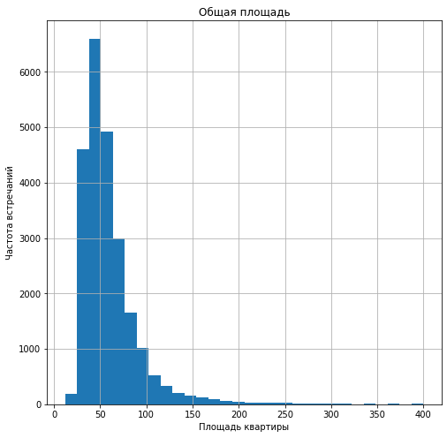
    


**общая площадь** - в основном представлены объекты площадью от 30 до 60 кв. м., большие объекты более 200 кв м представлены уже в единичном кол-ве - их всего во всей базе 227 штук, максимальное кол-во кв м составляет 900, данное значение выглядит очень большим для квартиры, но тем не менее утверждать, что это ошибка, оснований нет;


```python
#гистограмма жилой площади, ограничена 150 кв м для наглядности
data.query('living_area <= 150').hist('living_area',bins=30, figsize=(8,8))
plt.title('Жилая площадь')
plt.xlabel('Площадь жилой зоны')
plt.ylabel('Частота встречаний')
plt.show()

```


    
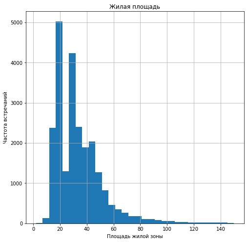
    


**жилая площадь** - лежит в диапазоне от 15 до 40 кв м, что выглядит логичным, учитывая общую площадь. Однако, были обнаружены 10 объектов, общая площадь которых в 3 раза превышает сумму площадей жилой зоны и кухни, что выглядит подозрительно. А также 64 объекта, где сумма площадей жилой зоны и кухни выше чем общая площадь, так как этих квартир всего 74 штуки в общем это менее полупроцента я не исключала их из анализа.


```python
#проверила сколько объектов в которых кухни больше 60 кв м
print('Количество объектов, в которых кухни больше 60 кв м: ', len(data.query('kitchen_area > 60')))
#гистограмма площади кухни, ограничена 60 кв м для наглядности
data.query('kitchen_area <= 60').hist('kitchen_area',bins=30, figsize=(8,8))
plt.title('Площадь кухни')
plt.xlabel('Площадь кухни')
plt.ylabel('Частота встречаний')
plt.show()

```

    Количество объектов, в которых кухни больше 60 кв м:  34


    
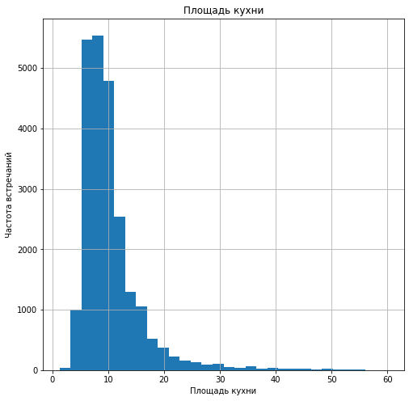
    


**площадь кухни** - наиболее часто на кухни приходится 5 - 11 квадратных метров. Кухни свыше 30 квадратных метров представлены уже единичными объектами. Максимальная кухня составляет 112 квадратных метров, что само по себе конечно очень много, кухни более 60 кв м представлены 34 объектами.


```python
#срез по аномалиям в площади - общая площадь меньше чем жилая и кухни
display(data[['total_area', 'living_area', 'kitchen_area']].query('total_area<living_area or total_area<kitchen_area or total_area<living_area+kitchen_area')) 
#срез по аномалиям -  общая площадь более чем в 3 раза больше жилой и кухни - тоже странно
display(data[['total_area', 'living_area', 'kitchen_area']].query('total_area/(living_area+kitchen_area) > 3'))
```


<div>
<style scoped>
    .dataframe tbody tr th:only-of-type {
        vertical-align: middle;
    }

    .dataframe tbody tr th {
        vertical-align: top;
    }

    .dataframe thead th {
        text-align: right;
    }
</style>
<table border="1" class="dataframe">
  <thead>
    <tr style="text-align: right;">
      <th></th>
      <th>total_area</th>
      <th>living_area</th>
      <th>kitchen_area</th>
    </tr>
  </thead>
  <tbody>
    <tr>
      <th>184</th>
      <td>30.20</td>
      <td>26.10</td>
      <td>6.200000</td>
    </tr>
    <tr>
      <th>424</th>
      <td>98.00</td>
      <td>88.00</td>
      <td>16.986667</td>
    </tr>
    <tr>
      <th>440</th>
      <td>27.11</td>
      <td>24.75</td>
      <td>4.699067</td>
    </tr>
    <tr>
      <th>545</th>
      <td>23.80</td>
      <td>20.00</td>
      <td>5.000000</td>
    </tr>
    <tr>
      <th>551</th>
      <td>31.59</td>
      <td>30.55</td>
      <td>9.280000</td>
    </tr>
    <tr>
      <th>...</th>
      <td>...</td>
      <td>...</td>
      <td>...</td>
    </tr>
    <tr>
      <th>22246</th>
      <td>27.30</td>
      <td>23.30</td>
      <td>4.732000</td>
    </tr>
    <tr>
      <th>22907</th>
      <td>228.00</td>
      <td>200.00</td>
      <td>39.520000</td>
    </tr>
    <tr>
      <th>23102</th>
      <td>66.00</td>
      <td>55.50</td>
      <td>11.440000</td>
    </tr>
    <tr>
      <th>23191</th>
      <td>18.90</td>
      <td>16.00</td>
      <td>3.276000</td>
    </tr>
    <tr>
      <th>23202</th>
      <td>67.92</td>
      <td>63.00</td>
      <td>13.040000</td>
    </tr>
  </tbody>
</table>
<p>119 rows × 3 columns</p>
</div>


<div>
<style scoped>
    .dataframe tbody tr th:only-of-type {
        vertical-align: middle;
    }

    .dataframe tbody tr th {
        vertical-align: top;
    }

    .dataframe thead th {
        text-align: right;
    }
</style>
<table border="1" class="dataframe">
  <thead>
    <tr style="text-align: right;">
      <th></th>
      <th>total_area</th>
      <th>living_area</th>
      <th>kitchen_area</th>
    </tr>
  </thead>
  <tbody>
    <tr>
      <th>8325</th>
      <td>52.0</td>
      <td>9.0</td>
      <td>6.000000</td>
    </tr>
    <tr>
      <th>9471</th>
      <td>78.0</td>
      <td>12.5</td>
      <td>8.500000</td>
    </tr>
    <tr>
      <th>13915</th>
      <td>52.0</td>
      <td>2.0</td>
      <td>9.000000</td>
    </tr>
    <tr>
      <th>14991</th>
      <td>413.5</td>
      <td>74.2</td>
      <td>13.900000</td>
    </tr>
    <tr>
      <th>17753</th>
      <td>117.3</td>
      <td>23.6</td>
      <td>12.900000</td>
    </tr>
    <tr>
      <th>18701</th>
      <td>165.2</td>
      <td>41.1</td>
      <td>13.400000</td>
    </tr>
    <tr>
      <th>21338</th>
      <td>190.0</td>
      <td>43.0</td>
      <td>13.000000</td>
    </tr>
    <tr>
      <th>21758</th>
      <td>23.0</td>
      <td>2.0</td>
      <td>3.986667</td>
    </tr>
    <tr>
      <th>21943</th>
      <td>77.6</td>
      <td>5.4</td>
      <td>9.800000</td>
    </tr>
    <tr>
      <th>23394</th>
      <td>92.0</td>
      <td>13.0</td>
      <td>10.000000</td>
    </tr>
    <tr>
      <th>23574</th>
      <td>139.0</td>
      <td>3.0</td>
      <td>16.000000</td>
    </tr>
  </tbody>
</table>
</div>


Были обнаружены 10 объектов, общая площадь которых в 3 раза превышает сумму площадей жилой зоны и кухни, что выглядит подозрительно. А также 64 объекта, где сумма площадей жилой зоны и кухни выше чем общая площадь, так как этих квартир всего 129 штуки в общем, это менее полупроцента, я не исключала их из анализа.


```python
#проверила сколько объектов дороже 60 млн руб.
print('Количество объектов больше 60 млн рублей равно', len(data.query('k_price > 60000')))
#гистограмма ограничена 60 млн руб. для наглядности
data.query('k_price <= 60000').hist('k_price',bins=30, figsize=(8,8))
plt.title('Цена объекта')
plt.xlabel('Цена объекта')
plt.ylabel('Частота встречаний')
plt.show()

```

    Количество объектов больше 60 млн рублей равно 101


    
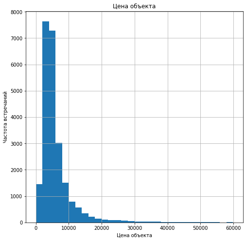
    


**цена объекта** - кол-во квартир стоимостью от 60 млн до 738 не превышает 1% - не брала их в расчет при строинии гистограммы. В основном стоимость квартир лежит в диапазоне до 9 млн рублей, что выглядит логичным, учитывая популярность квартир площадью от 30 до 60 кв.


```python
#проверка на существенность кол-ва многокомнатных квартир
print('Количество объектов, в которых больше 6 комнат равно', len(data.query('rooms > 6')))
#проверка есть ли квартиры, где кол-во комнат несоразмерно площади - примерно определили 8 кв м на комнату
print('Количество объектов, где комнаты меньше 8 кв м равно', len(data.query('total_area/rooms < 8'))) 
#гистограмма ограничена 6 комнатами для наглядности
data.query('rooms <= 6').hist('rooms', bins=30, figsize=(8,8))
plt.title('Количество комнат')
plt.xlabel('Количество комнат')
plt.ylabel('Частота встречаний')
plt.show()

```

    Количество объектов, в которых больше 6 комнат равно 90
    Количество объектов, где комнаты меньше 8 кв м равно 0


    
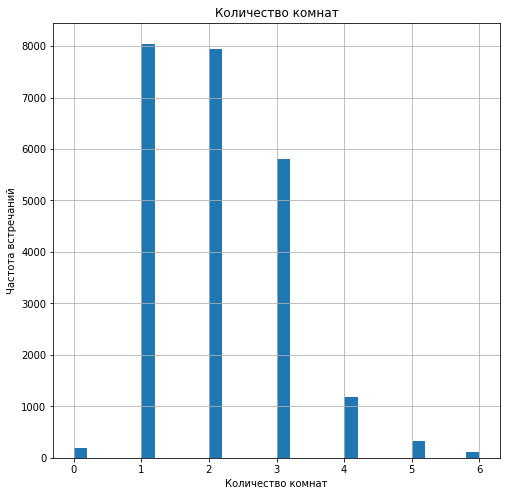
    


**количество комнат** - максимальное количество комнат равно 19, число выглядит очень большим, но в результате проверки было выявлено, что во-первых, доля объектов, где кол-во комнат больше 6, не превышает 1%, а во-вторых, нет объектов, в которых бы кол-во комнат выглядело бы ошибочным по сравнению с площадью. В основном представлены объекты, в которых 1-2-3 комнаты.


```python
#проверка на существенность кол-ва многоэтажных домов
print('Количество объектов, в которых больше 25 этажей равно', len(data.query('floors_total_adj > 25')))
#расчет для комментария
print('Доля объектов высотой 5 и 9 этажей - {floor:.0%}'.format(floor=(len(data.query('floors_total_adj == 6 or floors_total_adj == 9'))/len(data['floors_total_adj']))))
#гистограмма ограничена 25 этажами для наглядности
data.query('floors_total_adj <= 25').hist('floors_total_adj' ,bins=30, figsize=(8,8))
plt.title('Этажность')
plt.xlabel('Этаж квартиры')
plt.ylabel('Частота встречаний')
plt.show()
```

    Количество объектов, в которых больше 25 этажей равно 342
    Доля объектов высотой 5 и 9 этажей - 20%


    
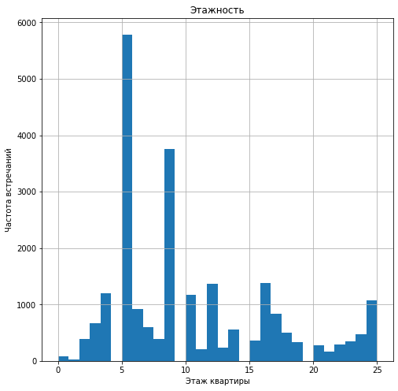
    


**общее количество этажей в доме** - макс кол-во этажей в доме 60, всего объектов свыше 30 этажей 32, а больше 25 - 342, что в процентном соотношении около 1%. Рассматривая только этажность более 25 видно, что в основном в продаже были объекты высотой 5 и 9 этаже - их около 20% в общем объеме - больше 3500 объектов.


```python
data.pivot_table(index='floor_type',values='locality_name',aggfunc='count').plot(y='locality_name',kind='pie',figsize=(10,10),label='Тип этажа',legend=False)
plt.title('Тип этажа квартиры')
plt.show()
```


    
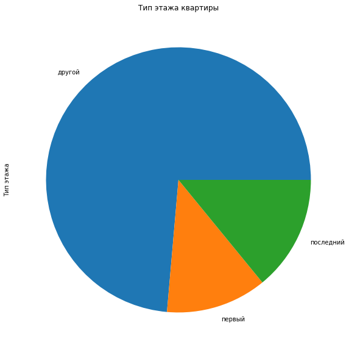
    


В основном продаются квартиры на промежуточных этажах. Учитывая большую долю многоэтажных домов, ожидала, что на  на первый и последний этажи будет приходится меньшая доля квартир, но согласно графику видно, что более четверти квартир приходятся на 1 и послдений этажи.   


```python
#высоту потолка больше 100 разделила на 10 - так она выглядит правдоподобнее
data.loc[data['ceiling_height'] > 100, 'ceiling_height'] = data['ceiling_height']/10 
#проверила объекты где высота потолка больше 5, но меньше 100
print('Количество объектов, в которых высота потолка от 5 до 100 метров: ', len(data.query('5 < ceiling_height < 100')))
#проверила высоту потолка меньше 2 метров
print('Количество объектов, в которых высота потолка до 2 метров: ', len(data.query('ceiling_height < 2'))) 
#высоту потолка меньше 2х метров выглядит странно
display(data.query('ceiling_height < 2'))
#гистограмма ограничены адекватрыми значениями высоты до потолка
data.hist('ceiling_height', range=(1.9,5), figsize=(8,8))
plt.title('Высота потолка')
plt.xlabel('Высота потолка')
plt.ylabel('Частота встречаний')
plt.show()

```

    Количество объектов, в которых высота потолка от 5 до 100 метров:  39
    Количество объектов, в которых высота потолка до 2 метров:  3


<div>
<style scoped>
    .dataframe tbody tr th:only-of-type {
        vertical-align: middle;
    }

    .dataframe tbody tr th {
        vertical-align: top;
    }

    .dataframe thead th {
        text-align: right;
    }
</style>
<table border="1" class="dataframe">
  <thead>
    <tr style="text-align: right;">
      <th></th>
      <th>total_images</th>
      <th>last_price</th>
      <th>total_area</th>
      <th>first_day_exposition</th>
      <th>rooms</th>
      <th>ceiling_height</th>
      <th>floors_total</th>
      <th>living_area</th>
      <th>floor</th>
      <th>is_apartment</th>
      <th>...</th>
      <th>days_exposition</th>
      <th>floors_total_adj</th>
      <th>corrected_name</th>
      <th>sq_meter_price</th>
      <th>day_of_week</th>
      <th>month_of_exposition</th>
      <th>year_of_exposition</th>
      <th>floor_type</th>
      <th>km_to_city_center</th>
      <th>k_price</th>
    </tr>
  </thead>
  <tbody>
    <tr>
      <th>5712</th>
      <td>5</td>
      <td>1500000.0</td>
      <td>42.8</td>
      <td>2017-08-14</td>
      <td>2</td>
      <td>1.20</td>
      <td>2</td>
      <td>27.5</td>
      <td>1</td>
      <td>False</td>
      <td>...</td>
      <td>248.0</td>
      <td>2</td>
      <td>поселок Мга</td>
      <td>35046.73</td>
      <td>0</td>
      <td>8</td>
      <td>2017</td>
      <td>первый</td>
      <td>NaN</td>
      <td>1500.0</td>
    </tr>
    <tr>
      <th>16934</th>
      <td>5</td>
      <td>4100000.0</td>
      <td>40.0</td>
      <td>2017-10-17</td>
      <td>1</td>
      <td>1.75</td>
      <td>37</td>
      <td>17.4</td>
      <td>5</td>
      <td>False</td>
      <td>...</td>
      <td>71.0</td>
      <td>37</td>
      <td>Санкт-Петербург</td>
      <td>102500.00</td>
      <td>1</td>
      <td>10</td>
      <td>2017</td>
      <td>другой</td>
      <td>20.0</td>
      <td>4100.0</td>
    </tr>
    <tr>
      <th>22590</th>
      <td>16</td>
      <td>6000000.0</td>
      <td>55.0</td>
      <td>2018-10-31</td>
      <td>2</td>
      <td>1.00</td>
      <td>12</td>
      <td>32.4</td>
      <td>7</td>
      <td>False</td>
      <td>...</td>
      <td>13.0</td>
      <td>12</td>
      <td>Санкт-Петербург</td>
      <td>109090.91</td>
      <td>2</td>
      <td>10</td>
      <td>2018</td>
      <td>другой</td>
      <td>14.0</td>
      <td>6000.0</td>
    </tr>
  </tbody>
</table>
<p>3 rows × 31 columns</p>
</div>


    
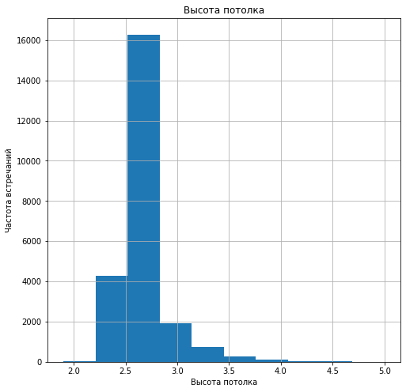
    


**высота потолков** - объекты, высота потолка которых была более 100 м, разделила на 10, тем не менее остались квартиры с высотой потолков 10 метров, что тоже не выглядит правдоподобно, как и квартиры с высотой потолков менее 2 метров - их в совокупности 41 штук, данное кол-во несущественно влияет на анализ, так как остальные параметры выглядят правдоподобно не удаляля их. Как и ожидалось, в основном у объектов высота потолков стремится к 2.5 м - 2.7м. Квартиры с потолками свыше 4 м представлены в малом количестве. Однако в данном столбце было много пропущенных значений (около 9000, что в целом искажает данные), но высота потолков зависит от типа дома, который в свою очередь может зависить от года постройки, но не от расположения, поэтому заполнив все значения медианой, мы все равно исказили бы анализ популяризировав медианное значение.  


```python
#проверили объекты, которые удалены от центра на более 30 км
print('Доля объектов, которые удалены от центра на более 30 км - {share:.0%}'.format(share=(len(data.query('cityCenters_nearest > 30000'))/len(data['cityCenters_nearest']))))
#Построили гистограмму по объектам до 30 км и которые не NaN
data.query('cityCenters_nearest < 30000 and not cityCenters_nearest.isna()').hist('cityCenters_nearest', range=(0,30000), figsize=(8,8))
plt.title('Удаленность от центра')
plt.xlabel('Удаленность от центра')
plt.ylabel('Частота встречаний')
plt.show()
```

    Доля объектов, которые удалены от центра на более 30 км - 6%


    
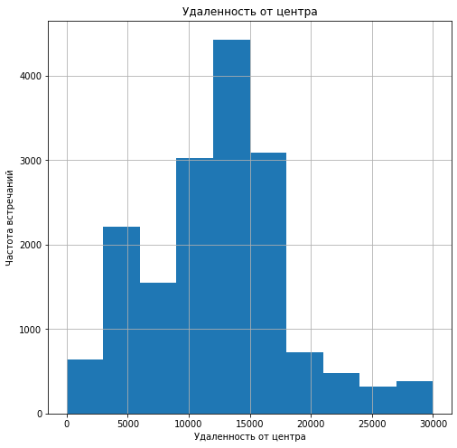
    


**расстояние до центра города в метрах** - доля объектов, удаленных  от центра на расстоянии более чем 30 км - 6% - исключила их из гистограммы. Наиболее часто встречаются объекты, удаленные от центра на 10 - 17 км. Объекты, которые располагаются в центре встречаются редко - почти также редко как удаленные на 20-25-30 км.


```python
#проверили объекты, которые удалены от парков на более чем 1 км
print('Доля объектов, которые удалены от парков на более чем 1 км - {share:.0%}'.format(share=(len(data.query('parks_nearest > 1000'))/len(data['parks_nearest']))))
#Построили гистограмму по объектам до 1 км и которые не входят в список странных строк
data.query('0 < parks_nearest < 1000 and not parks_nearest.isna()').hist('parks_nearest', range=(0,1000), figsize=(8,8))
plt.title('Удаленность от парков')
plt.xlabel('Удаленность от парков')
plt.ylabel('Частота встречаний')
plt.show()
```

    Доля объектов, которые удалены от парков на более чем 1 км - 2%


    
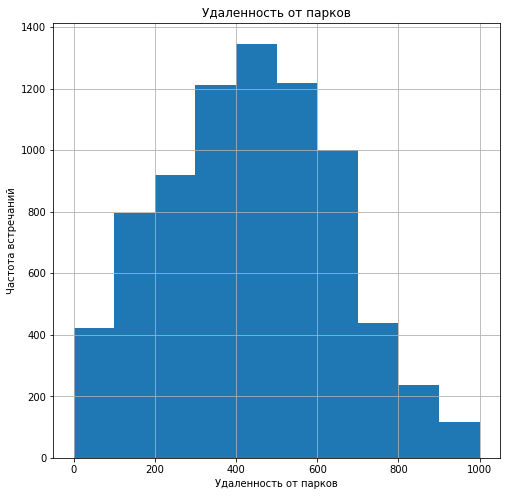
    


**расстояние до ближайшего парка** - парки, которые располагаются на удаленности более 1 км составляют 1%- их исключила из анализа. В основном парки находятся на расстоянии 300-700 метров.


```python
#пивот по days_exposition, выявили регионы без значений по days_exposition
time_of_sales = (
    data.pivot_table(index='corrected_name',values='days_exposition',aggfunc=['mean','median','count'])
    .round(0)
)
time_of_sales.columns = ['av_days','median_days','exposition_qty']
time_of_sales = time_of_sales.query('exposition_qty not in  exposition_qty.isna()')
#создала датафрейм, чтобы значения corrected_name были обычным столбцом, не индексами 
time_of_sales_df = (
    pd.DataFrame({
        'corrected_name':time_of_sales.index, 
        'av_days':time_of_sales['av_days'],
        'median_days':time_of_sales['median_days'],
        'exposition_qty':time_of_sales['exposition_qty']
})
)

#Отфильтровала и отсортировала таблицу - описываю в комментарии
time_of_sales_df = (
    time_of_sales_df.query('exposition_qty > 20')
    .sort_values(by='av_days',ascending=False)
    .reset_index(drop=True)
)
display(time_of_sales_df.head(10)) #Для проверки

```


<div>
<style scoped>
    .dataframe tbody tr th:only-of-type {
        vertical-align: middle;
    }

    .dataframe tbody tr th {
        vertical-align: top;
    }

    .dataframe thead th {
        text-align: right;
    }
</style>
<table border="1" class="dataframe">
  <thead>
    <tr style="text-align: right;">
      <th></th>
      <th>corrected_name</th>
      <th>av_days</th>
      <th>median_days</th>
      <th>exposition_qty</th>
    </tr>
  </thead>
  <tbody>
    <tr>
      <th>0</th>
      <td>Волосово</td>
      <td>280.0</td>
      <td>114.0</td>
      <td>31</td>
    </tr>
    <tr>
      <th>1</th>
      <td>Павловск</td>
      <td>248.0</td>
      <td>134.0</td>
      <td>31</td>
    </tr>
    <tr>
      <th>2</th>
      <td>Коммунар</td>
      <td>247.0</td>
      <td>126.0</td>
      <td>74</td>
    </tr>
    <tr>
      <th>3</th>
      <td>Локация_не_определена</td>
      <td>239.0</td>
      <td>211.0</td>
      <td>48</td>
    </tr>
    <tr>
      <th>4</th>
      <td>Никольское</td>
      <td>236.0</td>
      <td>123.0</td>
      <td>77</td>
    </tr>
    <tr>
      <th>5</th>
      <td>Приозерск</td>
      <td>236.0</td>
      <td>162.0</td>
      <td>51</td>
    </tr>
    <tr>
      <th>6</th>
      <td>Ломоносов</td>
      <td>219.0</td>
      <td>124.0</td>
      <td>114</td>
    </tr>
    <tr>
      <th>7</th>
      <td>Шлиссельбург</td>
      <td>212.0</td>
      <td>102.0</td>
      <td>45</td>
    </tr>
    <tr>
      <th>8</th>
      <td>Пушкин</td>
      <td>210.0</td>
      <td>130.0</td>
      <td>307</td>
    </tr>
    <tr>
      <th>9</th>
      <td>Сестрорецк</td>
      <td>209.0</td>
      <td>113.0</td>
      <td>163</td>
    </tr>
  </tbody>
</table>
</div>


Около 3 тысяч значений пропущено в столбце days_exposition, которые оказывают влияние на среднюю. В ходе анализы изначально мной были выделены жилые регионы, где нет значений в столбце days_exposition, они были удалены из новой таблицы time_of_sales, так как все равно не дают никакой ясности в исследуемом вопросе.
    
Далее на основании отфильтрованных данных time_of_sales был создан датафрейм, в ходе исследования которого было выяснено, что по части поседков/городов было очень мало продаж, что скорее всего тоже будет искажать вывод, так как продажи по данным регионам - это редкость. 

В результате мы получили массив, который содержит в себе все еще 94% изначальной информации, но при этом около 13% значений отсутствуют, влияя на среднюю - удалила их из рассматриваемых данных.


```python
print('Доля городов, где кол-во показов превышает 25 в общем объеме: ',len(data.query('corrected_name in @time_of_sales_df.corrected_name'))/len(data))
print('Доля строк, где не указано сколько дней было размещено объявлени: ',len(data.query('corrected_name in @time_of_sales_df.corrected_name and days_exposition.isna()'))/len(data.query('corrected_name in @time_of_sales_df.corrected_name')))

#Отфильтровала DATA, оставив только те наименования, которые есть в отфильтрованном датафрейме time_of_sales_df
#и по которым нет пропусков в рассматриваемом столбце
filtered_data = data.query('corrected_name in @time_of_sales_df.corrected_name and not days_exposition.isna()')
print('Средний срок продажи, исходя из рассматриваемых данных: ', filtered_data['days_exposition'].mean())
print('Медиана срока продаж, исходя из рассматриваемых данных: ', filtered_data['days_exposition'].median())
print(filtered_data['days_exposition'].describe()) #Для более подробного изучения данных

filtered_data.hist('days_exposition',bins=200,range=(0,1600)) #Гистограмма со всеми значениями
plt.title('Срок размещения объявления')
plt.xlabel('Срок объявления')
plt.ylabel('Частота встречаний')
plt.show()
filtered_data.hist('days_exposition',bins=200,range=(0,229)) #Гистограмма до 300 дней по оси Х - так лучше видно
plt.title('Срок размещения объявления')
plt.xlabel('Срок объявления')
plt.ylabel('Частота встречаний')
plt.show()
```

    Доля городов, где кол-во показов превышает 25 в общем объеме:  0.9405460145997722
    Доля строк, где не указано сколько дней было размещено объявлени:  0.12794975325257962
    Средний срок продажи, исходя из рассматриваемых данных:  180.02119559625476
    Медиана срока продаж, исходя из рассматриваемых данных:  94.0
    count    19438.000000
    mean       180.021196
    std        219.889161
    min          1.000000
    25%         44.000000
    50%         94.000000
    75%        229.000000
    max       1580.000000
    Name: days_exposition, dtype: float64


    
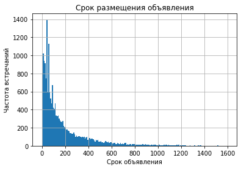
    


    
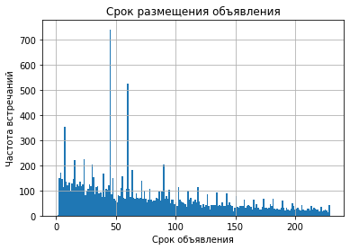
    


Согласно анализу среднее кол-во дней, за которые была продана квартира, равна 180 дням, медианное значение почти в два раза меньше и равно 94, это означает, что есть выделяющиеся из общей массы значения, которые являются нестандартными для рассматриваемого массива данных. Согласно гистограмме наиболее много квартир было продано в срок 45, 60 дней, однако, данные сроки нельзя считать средними, скорее быстрыми (25% квартир продаются в срок до полутора месяцев). В выводе описания массива (метод describe) видно, что в половине случаев квартиры продавались в срок до 3 месяцев и 75% в срок до 7,5 месяцев. Свыше 7,5 месяцев (>229 дней) квартиры продаются в 1/4 случаев, из которых продажи свыше 600 дней осуществляются в редких случаев.


```python
#для удобства взяла из первоначальных данных только нужные столбцы
table_for_corr = data[['total_area', 'living_area', 'kitchen_area','rooms','floor_type','day_of_week','month_of_exposition','year_of_exposition','k_price']]

#таблица корреляции всего с k_price
display('***Таблица корреляции k_price с остальными компонентами***',table_for_corr.corr().loc['k_price']) 
display(table_for_corr.head())
```


    '***Таблица корреляции k_price с остальными компонентами***'


    total_area             0.653675
    living_area            0.585891
    kitchen_area           0.513710
    rooms                  0.363343
    day_of_week            0.001550
    month_of_exposition    0.002779
    year_of_exposition    -0.043089
    k_price                1.000000
    Name: k_price, dtype: float64


<table border="1" class="dataframe">
  <thead>
    <tr style="text-align: right;">
      <th></th>
      <th>total_area</th>
      <th>living_area</th>
      <th>kitchen_area</th>
      <th>rooms</th>
      <th>floor_type</th>
      <th>day_of_week</th>
      <th>month_of_exposition</th>
      <th>year_of_exposition</th>
      <th>k_price</th>
    </tr>
  </thead>
  <tbody>
    <tr>
      <th>0</th>
      <td>108.0</td>
      <td>51.000000</td>
      <td>25.00</td>
      <td>3</td>
      <td>другой</td>
      <td>3</td>
      <td>3</td>
      <td>2019</td>
      <td>13000.0</td>
    </tr>
    <tr>
      <th>1</th>
      <td>40.4</td>
      <td>18.600000</td>
      <td>11.00</td>
      <td>1</td>
      <td>первый</td>
      <td>1</td>
      <td>12</td>
      <td>2018</td>
      <td>3350.0</td>
    </tr>
    <tr>
      <th>2</th>
      <td>56.0</td>
      <td>34.300000</td>
      <td>8.30</td>
      <td>2</td>
      <td>другой</td>
      <td>3</td>
      <td>8</td>
      <td>2015</td>
      <td>5196.0</td>
    </tr>
    <tr>
      <th>3</th>
      <td>159.0</td>
      <td>91.730769</td>
      <td>27.56</td>
      <td>3</td>
      <td>другой</td>
      <td>4</td>
      <td>7</td>
      <td>2015</td>
      <td>64900.0</td>
    </tr>
    <tr>
      <th>4</th>
      <td>100.0</td>
      <td>32.000000</td>
      <td>41.00</td>
      <td>2</td>
      <td>другой</td>
      <td>1</td>
      <td>6</td>
      <td>2018</td>
      <td>10000.0</td>
    </tr>
  </tbody>
</table>


Как видно из таблицы корреляции last_price с остальными компонентами, дата размещения - будь то день недели, месяц или год - не влияет на общую стоимость. Коэффициент корреляции минимален и стремится к 0, не строю графики для этих категорий. В таблице также видно, что самая большая корреляция наблюдается с общей площадью.   
    
Ниже построила графики для всех параметров, по которым в таблице существует корреляция, а также по столбцу floor_type. 


```python
#Вводный график, чтобы отсечь нестандартные единичные высокие цены
table_for_corr.plot(x='k_price', y='total_area', kind='scatter', xlabel='Стоимость квартиры', ylabel='Площадь',  alpha=0.6, grid=True, sharex=False)
plt.title('График №1. Зависимость цены от площади')
plt.show()

```


    
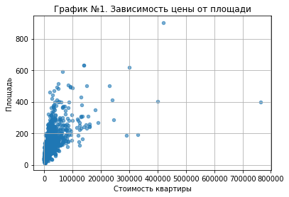
    


Согласно Графику №1 взаимосвязи цены и общей площади видно, что значения более 200 млн уже единичны, поэтому для прослеживавния взаимосвязи и наглядности последующие графики ограничены по оси Х до 200 000 тыс. руб. 


```python
print('***Корреляция общей площади и площади кухни***',table_for_corr['kitchen_area'].corr(table_for_corr['total_area']))
print('***Корреляция общей площади и жилой площади***',table_for_corr['living_area'].corr(table_for_corr['total_area']))
#Построили график зависимости различной площади и стоимости
table_for_corr.pivot_table(index='k_price',values=['total_area','living_area','kitchen_area']).plot(xlim=(0,200000), grid=True, xlabel='Стоимость квартиры', ylabel='Площадь', figsize=(8,8), sharex=False)
plt.title('График №2. Взаимосвязь различной площади и стоимости')
plt.show()

```

    ***Корреляция общей площади и площади кухни*** 0.6601347396052482
    ***Корреляция общей площади и жилой площади*** 0.9462534256263033


    
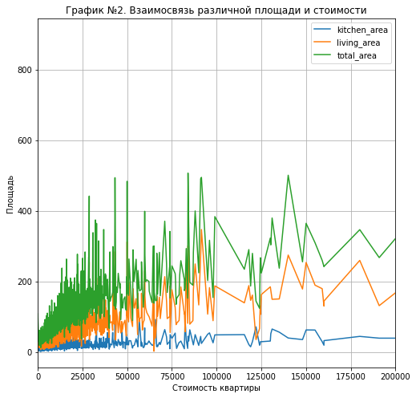
    


На Графике №2, отражающем взаимосвязь различной площади и стоимости видно, что несмотря на видимый рост цены в связи с ростом общей площади и отдельных площадей жилой зоны и кухни, это не единственные факторы, влияющие на цену - мы видим выбивающиеся из стройного графика пики. Также существует взаимосвязь между площадью кухни и общей площадью, поэтому утверждать, что стоимость квартир зависит от площади кухни сложно. Скорее всего площадь кухни коррелирует с общей/жилой площадью, которые коррелирует со стоимостью. Тоже самое можно сказать и о жилой площади, корреляция между жилой площадью и общей площадью почти 100% (коэффициент равен 0.94). Очевидно, что стоимость квартиры зависит от метража, но скорее общего или жилого, нежели от метража кухни. В таблице с корреляцией мы видим, что корреляция с общей площадью сильнее чем с остальными площадами, коэффициент корреляции с площадью кухни и вовсе имеет пограничное значение - 0.5.


```python
print('***Корреляция кол-ва комнат и жилой площади***',table_for_corr['rooms'].corr(table_for_corr['living_area']))
print('***Корреляция кол-ва комнат и общей площади***',table_for_corr['rooms'].corr(table_for_corr['total_area']))
#Построили график зависимости кол-ва комнат и стоимости
table_for_corr.pivot_table(index='k_price',values='rooms').plot(xlim=(0,200000), figsize=(8,8), legend=False, xlabel='Стоимость квартиры', ylabel='Кол-во комнат', grid=True, sharex=False)
plt.title('График №3. Взаимосвязь кол-ва комнат и стоимости')
plt.show()

```

    ***Корреляция кол-ва комнат и жилой площади*** 0.8267955023522257
    ***Корреляция кол-ва комнат и общей площади*** 0.7583438234725666


    
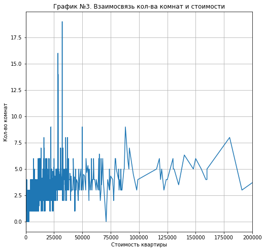
    


На Графике №3, отражающем взаимосвязь кол-ва комнат и стоимости, видно, что стоимость с ростом кол-ва комнат конечно растет, но очень слабо, большинство данных графика мы видим в диапазоне между 2 и 5 комнатами, распределенном практически по всему диапазону цен. Также кол-во комнат коррелирует с жилой и общей площадью (коэфф.корр.: 0.85 и 0.76 соответственно), что конечно увеличивает и цену, но прямая корреляция достаточно слабая - в таблице с корреляцией мы видим коэффициент 0.36.


```python
#Построили график зависимости типа этажа и стоимости
table_for_corr.pivot_table(index='total_area',columns='floor_type', values='k_price',aggfunc='median').plot(xlim=(0,300), ylim=(0,60000), xlabel='Площадь', ylabel='Стоимость квартиры', figsize=(8,8), grid=True, sharex=False)
plt.title('График №4. Взаимосвязь типа этажа и стоимости')
plt.show()
```


    
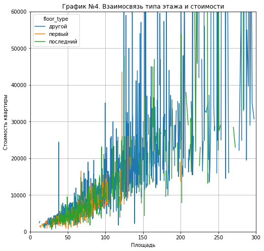
    


На Графике №4 отображена зависимость между типом этажа, общей площадью и стоимостью. Данный график для наглядности обрезан по оси x до 300 метров и по оси y до 60 млн руб. График был построен мной таким образом, чтобы увидить будут ли отдельные графики по первым и последним этажам сильно отклоняться от графика по промежуточным этажам. На мой взгляд несмотря на некоторые выбивающиеся объекты на первых этажах по почти 45 млн и 25 млн, основная масса квартир на первом этаже находится в диапазоне до 15 млн, тогда как квартиры на промежуточных этажах доходят часто и до 25 млн. Оранжевый график располагается заметно ниже синего, что говорит о том, что взаимосвязь все же присутствует и квартиры на первом этаже продаются дешевле, чем на промежуточных, но не 100%-ная. Квартиры на последних этажах продаются также чуть дешевле в общей массе, чем на промежуточных, но мы видим, что довольно часто на последних этажах продаются большие и дорогие квартиры, в отличии от оранжевого графика зеленый простирается гораздо дальше по области графика. 


```python
# Код ревьюера

import seaborn as sns
import numpy as np

sns.relplot(x='floor_type', y='k_price', data=data)
total_area=np.linspace(0,20)
plt.title('Зависимость цены этажа,на котором расположена квартира')
plt.xlabel('Этаж')
plt.ylabel('Цена')
plt.show()
```


    
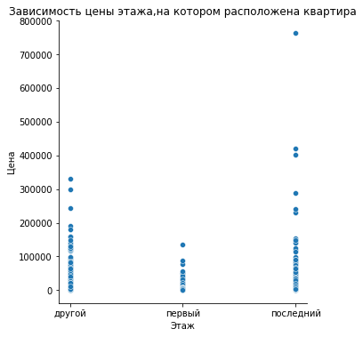
    


```python
#построила пивот, посчитала среднюю цену и кол-во объявлений
sq_meters_analysis = data.pivot_table(index='corrected_name',values='sq_meter_price',aggfunc=['mean','count']) 
sq_meters_analysis.columns = ['mean_price','count'] #переименовала колонки
#определила топ-10 кол-ва объявлений
display(sq_meters_analysis.sort_values(by='count',ascending=False).head(10)) 

print('Всего парков ',sq_meters_analysis['count'].sum(),' из 23699') #проверка на полноту

```


<table border="1" class="dataframe">
  <thead>
    <tr style="text-align: right;">
      <th></th>
      <th>mean_price</th>
      <th>count</th>
    </tr>
    <tr>
      <th>corrected_name</th>
      <th></th>
      <th></th>
    </tr>
  </thead>
  <tbody>
    <tr>
      <th>Санкт-Петербург</th>
      <td>114849.008793</td>
      <td>15721</td>
    </tr>
    <tr>
      <th>поселок Мурино</th>
      <td>85681.762572</td>
      <td>556</td>
    </tr>
    <tr>
      <th>поселок Шушары</th>
      <td>78677.364318</td>
      <td>440</td>
    </tr>
    <tr>
      <th>Всеволожск</th>
      <td>68654.473970</td>
      <td>398</td>
    </tr>
    <tr>
      <th>Пушкин</th>
      <td>103125.819377</td>
      <td>369</td>
    </tr>
    <tr>
      <th>Колпино</th>
      <td>75424.579112</td>
      <td>338</td>
    </tr>
    <tr>
      <th>поселок Парголово</th>
      <td>90175.913089</td>
      <td>327</td>
    </tr>
    <tr>
      <th>Гатчина</th>
      <td>68746.146515</td>
      <td>307</td>
    </tr>
    <tr>
      <th>деревня Кудрово</th>
      <td>92473.547559</td>
      <td>299</td>
    </tr>
    <tr>
      <th>Выборг</th>
      <td>58141.909325</td>
      <td>237</td>
    </tr>
  </tbody>
</table>


    Всего парков  23699  из 23699


```python
top_ten = 236  #создала переменную и присвоила значение, в которое входит топ 10

#построили таблица, расположив среднюю цену по убыванию
top_sq_meters_analysis = sq_meters_analysis.query('count > @top_ten').sort_values(by='mean_price',ascending=False)
display(top_sq_meters_analysis)

max_price = top_sq_meters_analysis['mean_price'].max().round(2) #максимальная цена
max_price_region = top_sq_meters_analysis['mean_price'].idxmax() #регион, соответствующий максимальной цене
min_price = top_sq_meters_analysis['mean_price'].min().round(2) #минимальная цена
min_price_region = top_sq_meters_analysis['mean_price'].idxmin() #регион, соответствующий минимальной цене
print(f'В регионе {max_price_region} самая высокая стоимость квадратного метра {max_price}')
print(f'В регионе {min_price_region} самая низкая стоимость квадратного метра {min_price}')

```


<table border="1" class="dataframe">
  <thead>
    <tr style="text-align: right;">
      <th></th>
      <th>mean_price</th>
      <th>count</th>
    </tr>
    <tr>
      <th>corrected_name</th>
      <th></th>
      <th></th>
    </tr>
  </thead>
  <tbody>
    <tr>
      <th>Санкт-Петербург</th>
      <td>114849.008793</td>
      <td>15721</td>
    </tr>
    <tr>
      <th>Пушкин</th>
      <td>103125.819377</td>
      <td>369</td>
    </tr>
    <tr>
      <th>деревня Кудрово</th>
      <td>92473.547559</td>
      <td>299</td>
    </tr>
    <tr>
      <th>поселок Парголово</th>
      <td>90175.913089</td>
      <td>327</td>
    </tr>
    <tr>
      <th>поселок Мурино</th>
      <td>85681.762572</td>
      <td>556</td>
    </tr>
    <tr>
      <th>поселок Шушары</th>
      <td>78677.364318</td>
      <td>440</td>
    </tr>
    <tr>
      <th>Колпино</th>
      <td>75424.579112</td>
      <td>338</td>
    </tr>
    <tr>
      <th>Гатчина</th>
      <td>68746.146515</td>
      <td>307</td>
    </tr>
    <tr>
      <th>Всеволожск</th>
      <td>68654.473970</td>
      <td>398</td>
    </tr>
    <tr>
      <th>Выборг</th>
      <td>58141.909325</td>
      <td>237</td>
    </tr>
  </tbody>
</table>


    В регионе Санкт-Петербург самая высокая стоимость квадратного метра 114849.01
    В регионе Выборг самая низкая стоимость квадратного метра 58141.91


Самая высокая стоимость квартир в ленинградской области ожидаемо в Санкт-Петербурге, где средняя стоимость квадратного метра равна почти 115 тыс.рублей. Самая низкая стоимость квадратного метра в топ-10 популярных регионов в Выборге, стоимость кв метра здесь равна 58 тыс.рублей.


```python
#создала переменную, хранящую срез данных со средней и медианной ценой
spb_flats = data.query('locality_name == "Санкт-Петербург" and not km_to_city_center.isna()').pivot_table(index='km_to_city_center',values='k_price',aggfunc=['mean','median']).round(2) 
spb_flats.columns = ['av_price','median'] 
display(spb_flats.head(10))
spb_flats.plot(xlim=(0,30), grid=True, xlabel='Растояние до центра, км', ylabel='Стоимость', figsize=(8,8)) #построила график зависимости цены от удаленности
plt.title('Зависимость стоимости от растояния до центра')
plt.show()
```


<table border="1" class="dataframe">
  <thead>
    <tr style="text-align: right;">
      <th></th>
      <th>av_price</th>
      <th>median</th>
    </tr>
    <tr>
      <th>km_to_city_center</th>
      <th></th>
      <th></th>
    </tr>
  </thead>
  <tbody>
    <tr>
      <th>0.0</th>
      <td>31449.12</td>
      <td>17900.0</td>
    </tr>
    <tr>
      <th>1.0</th>
      <td>21206.72</td>
      <td>11395.0</td>
    </tr>
    <tr>
      <th>2.0</th>
      <td>17788.32</td>
      <td>10000.0</td>
    </tr>
    <tr>
      <th>3.0</th>
      <td>11126.58</td>
      <td>8409.0</td>
    </tr>
    <tr>
      <th>4.0</th>
      <td>13304.28</td>
      <td>9200.0</td>
    </tr>
    <tr>
      <th>5.0</th>
      <td>14499.12</td>
      <td>9500.0</td>
    </tr>
    <tr>
      <th>6.0</th>
      <td>15338.42</td>
      <td>8900.0</td>
    </tr>
    <tr>
      <th>7.0</th>
      <td>14775.15</td>
      <td>7800.0</td>
    </tr>
    <tr>
      <th>8.0</th>
      <td>9957.72</td>
      <td>7450.0</td>
    </tr>
    <tr>
      <th>9.0</th>
      <td>6950.66</td>
      <td>5300.0</td>
    </tr>
  </tbody>
</table>


    
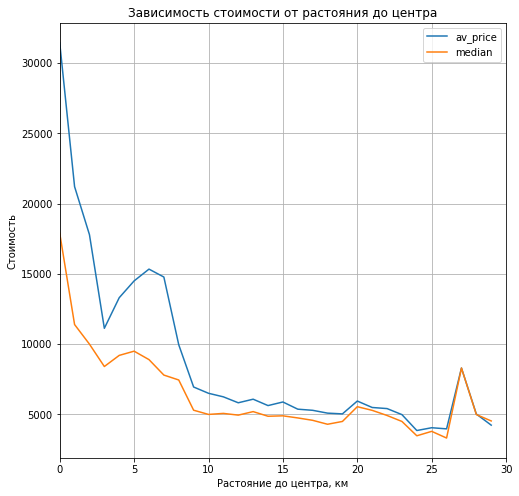
    


Ожидаемо стоимость квартир снижается, чем дальше кватира находится от центра. Однако на графике видно, что есть аномальные отклонения, например: 
 - квартиры, находящиеся на расстоянии 4-7 км не имеют такой прямой корреляции и явно выше по стоимости, чем квартиры, удаленные на 3 км, что также может говорить о рекордно низких ценах на некоторые квартиры в радиусе 3 км от центра;
 - также квартиры, удаленные на 24 км имеют стоимость ниже, чем удаленные на 25 и 26 км, а дорогие квартиры удаленные на 27 км также выглядят неоднозначно. 

На графике отображены средняя цена и медиана, на основании двух линейных графиков можно сделать вывод, что в случае 4-7 км есть квартиры сильно выбивающиеся из общего диапазона цен, но в целом медианные значения выглядят схожими со средними. Однако, чем ближе к центру тем больше квартир с отдеными ценовыми выбросами.     

### Напишите общий вывод

В ходе проведенного анализа и обработки данных были добавлены необходимые для анализа столбцы, заменены некоторые пропуски. Достаточно значительная часть пропусков по паркам, прудам и центру не была исправлена или удалена, так как кол-во достаточно большое, а подставление среднего или медианного значение может исказить анализ, так как опять же кол-во их существенное. В ходе анализа также были найдены несоответствия по ряду параметров, в виду несущественности кол-ва они не были удалены из анализа - детально описано выше.

**В ходе анализа были сделаны следующие выводы:**
Подтверждена взаимосвязь удаленности от центра и снижению цены, посчитан коэфф корреляции и наглядно продемонстрирована взаимосвязь цены и площади объекта. Интересным и неожиданным для меня результатом стало исследование зависимости этажности (первый/последний/промежуточный) и стоимости. Квартиры на первом этаже продавались ожидаемо дешевле, а вот квартиры на последнем этаже такой очевидной корреляции не показали, более того жилые объекты на последний этажах иногда продаются за дорого и большой площади.
Общая площадь продаваемой недвижимости в среднем составляет 30-60 кв метров, что в целом подчиняется логике, обоснованным также выглядят резултаты по этажности в Петербурге и Лен. области, несмотря на наличие объектов 25-60 этажей (их кол-во не превышает 1.5 процентов) в основном застройка не высокая 6-10 этажей. 

**Чек-лист готовности проекта**

Поставьте 'x' в выполненных пунктах. Далее нажмите Shift+Enter.

- [x]  Файл с данными открыт.
- [x]  Файл с данными изучен: выведены первые строки, использован метод `info()`, построены гистограммы.
- [x]  Найдены пропущенные значения.
- [x]  Пропущенные значения заполнены там, где это возможно.
- [x]  Объяснено, какие пропущенные значения обнаружены.
- [x]  В каждом столбце установлен корректный тип данных.
- [x]  Объяснено, в каких столбцах изменён тип данных и почему.
- [x]  Устранены неявные дубликаты в названиях населённых пунктов.
- [x]  Обработаны редкие и выбивающиеся значения (аномалии).
- [x]  В таблицу добавлены новые параметры:
       – цена одного квадратного метра;
       – день публикации объявления (0 - понедельник, 1 - вторник и т. д.);
       – месяц публикации объявления;
       – год публикации объявления;
       – тип этажа квартиры (значения — «первый», «последний», «другой»);
       – расстояние до центра города в километрах.
- [x]  Изучены и описаны параметры:
        - общая площадь;
        - жилая площадь;
        - площадь кухни;
        - цена объекта;
        - количество комнат;
        - высота потолков;
        - тип этажа квартиры («первый», «последний», «другой»);
        - общее количество этажей в доме;
        - расстояние до центра города в метрах;
        - расстояние до ближайшего парка.
- [x]  Выполнено задание «Изучите, как быстро продавались квартиры (столбец `days_exposition`)»:
    - построена гистограмма;
    - рассчитаны среднее и медиана;
    - описано, сколько обычно занимает продажа и указано, какие продажи можно считать быстрыми, а какие — необычно долгими.
- [x]  Выполнено задание «Определите факторы, которые больше всего влияют на общую (полную) стоимость объекта». Построены графики, которые показывают зависимость цены от параметров:
        - общая площадь;
        - жилая площадь;
        - площадь кухни;
        - количество комнат;
        - тип этажа, на котором расположена квартира (первый, последний, другой);
        - дата размещения (день недели, месяц, год).
- [x]  Выполнено задание «Посчитайте среднюю цену одного квадратного метра в 10 населённых пунктах с наибольшим числом объявлений»:
    - выделены населённые пункты с самой высокой и низкой стоимостью квадратного метра.
- [x]  Выполнено задание «Выделите квартиры в Санкт-Петербурге с помощью столбца `locality_name` и вычислите их среднюю стоимость на разном удалении от центра»:
    -  учтён каждый километр расстояния, известны средние цены квартир в одном километре от центра, в двух и так далее;
    -  описано, как стоимость объекта зависит от расстояния до центра города;
    -  построен график изменения средней цены для каждого километра от центра Петербурга.
- [x]  На каждом этапе сделаны промежуточные выводы.
- [x]  В конце проекта сделан общий вывод.


```python

```
